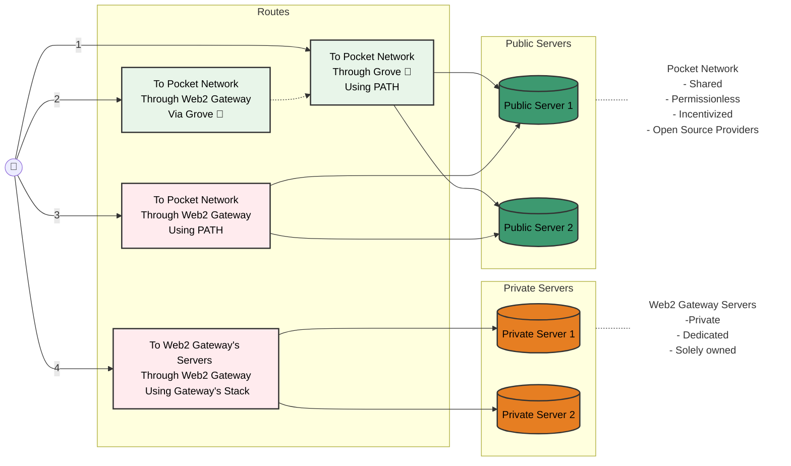

<h1>PATH Path API & Toolkit Harness</h1>

 

:::warning

🚧 This documentation is still under construction 🚧

:::

## Overview

**PATH** (Path API & Toolkit Harness) is an open source framework for enabling
access to a decentralized supply network.

It provides various tools and libraries to streamline the integration and
interaction with decentralized protocols.

## Getting Started

### PATH

Start by going through the [PATH Walkthrough](develop/path/introduction.md).
to learn how PATH works, how to configure it and how to run it locally.

### Envoy

Start by going through the [Envoy Walkthrough](./develop/envoy/walkthrough.md).
to learn how our Envoy integration works, how to configure it and how to run it locally.

## Is PATH for me?

If you're a Web2 Gateway Provider, you have four modes of operation to choose from:

1. **Step aside (N/A)**: Let clients use [Grove's Portal](https://portal.grove.city/) directly. For example, if you do not provide the services the client is looking for.

2. **Hybrid (Frontline)**: Provide a front-end using your custom stack but leverage [Grove's Portal API](https://docs.grove.city/) behind the scenes. For example, if you want to provide a custom front-end but leverage Grove's infrastructure.

3. **Full Stack (Direct):** Use `PATH` so you can provide the client with a custom experience but also settle traffic on `Pocket Network` yourself without relying on Grove's infrastructure.

4. **Independent (N/A):** Use your own stack to settle traffic on your own infrastructure, independent of `Grove`, `PATH` or `Pocket Network`.

Here's the information reorganized into a table and nodes section:

### Implementation Modes

| Mode                   | Your Infrastructure | Your Gateway | Your Frontend | PATH | Grove | Pocket Network | Description                                                     |
| ---------------------- | ------------------- | ------------ | ------------- | ---- | ----- | -------------- | --------------------------------------------------------------- |
| 1. Step Aside (N/A)    | ❌                  | ❌           | ❌            | ❌   | ✅    | ✅             | Provider directs clients to Grove's Portal for direct access    |
| 2. Hybrid (Frontline)  | ❌                  | ❌           | ✅            | ❌   | ✅    | ✅             | Provider uses custom frontend with Grove's Portal API backend   |
| 3. Full Stack (Direct) | ✅                  | ✅           | ✅            | ✅   | ❌    | ✅             | Provider uses PATH to settle traffic directly on Pocket Network |
| 4. Independent (N/A)   | ✅                  | ✅           | ✅            | ❌   | ❌    | ❌             | Provider uses entirely their own infrastructure and stack       |
