<h1>PATH API & Toolkit Harness</h1>

 

## Overview

**PATH (Path API & Toolkit Harness)** is an open source framework to enable access
to a permissionless network of API providers with enterprise-grade SLAs.

It provides all the necessary tools for you to deploy your own API Gateway without
needing to maintain the backend services.

An easy way to think about **PATH** and **Pocket Network** is:

- **Pocket Network** is a permissionless network of API providers for open source services and data sources
- **PATH** is a framework to build a Gateway that ensures high quality of service atop of Pocket Network

## Where do I get started?

To get started, allocate 1-3 hours of time and start with the [PATH Introduction](develop/path/introduction.md).

It will go through all the details of how PATH works, how to configure it, and how to run it locally.

## TODO

This documentation is an active work in progress and there's a lot more we want to add:

- [ ] Video tutorial walkthrough
- [ ] Deployment instructions
- [ ] Billing integrations
- [ ] ETL Pipelines
- [ ] [Add your request here](https://github.com/buildwithgrove/path/issues/new/choose)

## Is PATH for me?

If you're a Web2 Gateway Provider, you have four modes of operation to choose from:

1. **Dependent (Step Aside)**: Let clients use [Grove's Portal](https://portal.grove.city/) directly. For example, if you do not provide the services the customer is looking for.

2. **Grove Hybrid (Frontend)**: Provide a custom front-end experience and build your own gateway infrastructure but leverage [Grove's Portal API](https://docs.grove.city/) behind the **scenes**. For example, if you want want to build your own business logic around quality-of-service, load balancing, authentication as well as building your own front-end.

3. **PATH Hybrid (Full Stack):** Use `PATH` so you can provide the client with a customized end-to-end experience but also settle traffic on `Pocket Network` yourself without relying on `Grove`'s infrastructure at all.

4. **Independent (On Your Own):** Use your own stack to settle traffic on your own infrastructure, independent of `Grove`, `PATH` or `Pocket Network`.

Here's the information reorganized into a table and nodes section:

```mermaid
%%{init: {'flowchart': {'curve': 'basis', 'lineWidth': 2}, 'themeVariables': {'fontFamily': 'arial', 'nodeTextColor': '#000000', 'edgeTextColor': '#000000'}}}%%

flowchart LR
    Mobile((📱))

    subgraph Routes
        Grove1["To Pocket Network <br> Through Grove 🌿 <br> Using PATH"]
        Grove2["To Pocket Network <br> Through Web2 Gateway <br> Via Grove 🌿"]
        Grove3["To Pocket Network <br> Through Web2 Gateway <br> Using PATH"]
        Gateway["To Web2 Gateway's Servers <br> Through Web2 Gateway <br> Using Gateway's Stack"]
    end

    subgraph PubSrv["Public Servers"]
        Server1[(Public Server 1)]
        Server2[(Public Server 2)]
    end

    subgraph PrivSrv["Private Servers"]
        PServer1[(Private Server 1)]
        PServer2[(Private Server 2)]
    end

    PubLabel["Pocket Network <br> - Shared <br> - Permissionless <br> - Incentivized <br> - Open Source Providers"]
    PrivLabel["Web2 Gateway Servers <br> -Private <br> - Dedicated <br> - Solely owned"]

    Mobile ---> | 1\. Dependent | Grove1
    Mobile ---> | 2\. Grove Hybrid| Grove2
    Mobile ---> | 3\. PATH Hybrid | Grove3
    Mobile ---> | 4\. Independent | Gateway

    Grove1 --> Server1
    Grove1 --> Server2

    Grove2 -.-> Grove1

    Grove3 ---> Server1
    Grove3 ---> Server2

    Gateway ---> PServer1
    Gateway ---> PServer2


    %% Label connections
    PubSrv -.- PubLabel
    PrivSrv -.- PrivLabel

    %% Styling
    classDef publicServers fill:#3D9970,stroke:#333,stroke-width:2px,color:#000000
    classDef privateServers fill:#E67E22,stroke:#333,stroke-width:2px,color:#000000
    classDef groveRoute fill:#E8F5E9,stroke:#333,stroke-width:2px,color:#000000
    classDef web2Route fill:#FFEBEE,stroke:#333,stroke-width:2px,color:#000000
    classDef labelStyle fill:none,stroke:none
    class Server1,Server2 publicServers
    class PServer1,PServer2 privateServers
    class Grove1,Grove2 groveRoute
    class Grove3,Gateway web2Route
    class PubLabel,PrivLabel labelStyle
```

### Implementation Mode Comparison

If you're a Web2 Gateway Provider, you can use this table to understand you preferable mode of operation:

| Mode                         | Your Backend Infrastructure | Your Gateway Frontend | Your Gateway uses PATH | Customer uses Grove's Portal | Traffic Settled on Pocket Network | Description / Example                                                                                                         |
| ---------------------------- | --------------------------- | --------------------- | ---------------------- | ---------------------------- | --------------------------------- | ----------------------------------------------------------------------------------------------------------------------------- |
| 1. Dependent (Step Aside)    | ❌                          | ❌                    | ❌                     | ✅                           | ✅                                | Customers go to Grove's Portal for direct access                                                                              |
| 2. Grove Hybrid (Frontend)   | ❌                          | ✅                    | ❌                     | ❌                           | ✅                                | Customers go to your frontend but use Grove's Portal API backend behind the scenes                                            |
| 3. PATH Hybrid (Full Stack)  | ❌                          | ✅                    | ✅                     | ❌                           | ✅                                | Customers go to your frontend but use PATH's features (e.g. Quality-of Service) and settle traffic on Pocket network directly |
| 4. Independent (On Your Own) | ✅                          | ✅                    | ✅                     | ❌                           | ❌                                | Customers go to your frontend and dependent on your gateway and infrastructure across the whole stack                         |
