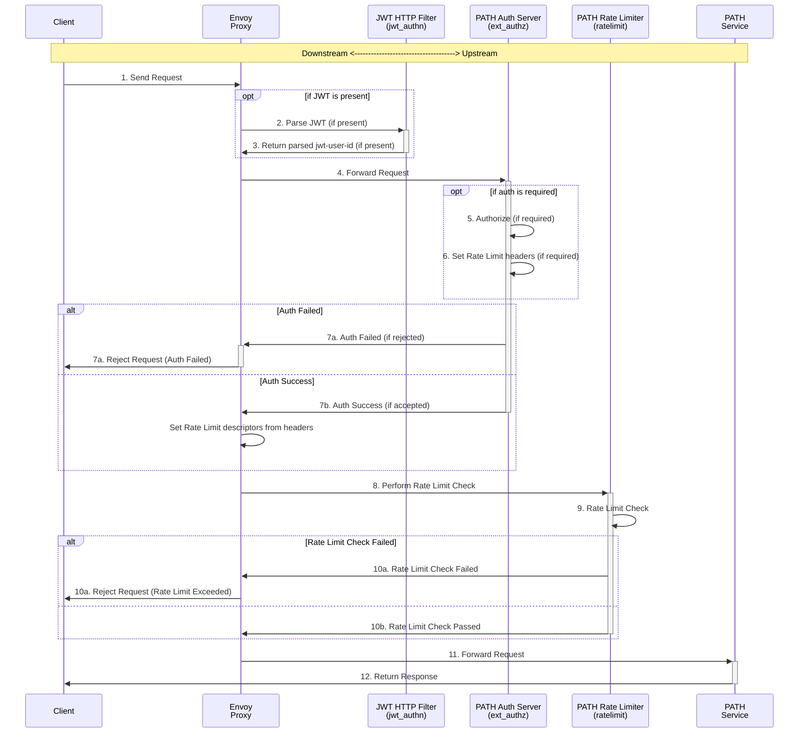
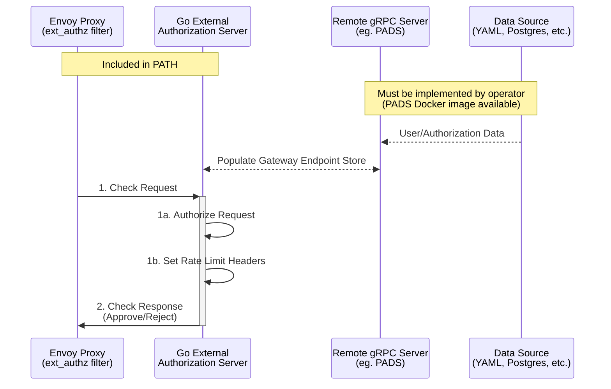

<div align="center">
<h1>PATH<br/>Authorization & Rate Limiting</h1>

</div>
<br/>

# Table of Contents <!-- omit in toc -->

- [Quickstart](#quickstart)
- [Overview](#overview)
  - [Components](#components)
  - [Architecture Diagram](#architecture-diagram)
- [Envoy Proxy](#envoy-proxy)
  - [Envoy Configuration](#envoy-configuration)
  - [Envoy HTTP Filters](#envoy-http-filters)
  - [Request Lifecycle](#request-lifecycle)
- [Service ID Specification](#service-id-specification)
  - [Allowed Services File](#allowed-services-file)
  - [Target Service ID Header](#target-service-id-header)
  - [URL Subdomain](#url-subdomain)
- [Specifying the Gateway Endpoint ID](#specifying-the-gateway-endpoint-id)
  - [URL Path Endpoint ID Extractor](#url-path-endpoint-id-extractor)
  - [Header Endpoint ID Extractor](#header-endpoint-id-extractor)
- [Gateway Endpoint Authorization](#gateway-endpoint-authorization)
  - [JSON Web Token (JWT) Authorization](#json-web-token-jwt-authorization)
  - [API Key Authorization](#api-key-authorization)
  - [No Authorization](#no-authorization)
- [External Authorization Server](#external-authorization-server)
  - [External Auth Service Sequence Diagram](#external-auth-service-sequence-diagram)
  - [External Auth Service Environment Variables](#external-auth-service-environment-variables)
  - [External Auth Service Getting Started](#external-auth-service-getting-started)
  - [Gateway Endpoints gRPC Service](#gateway-endpoints-grpc-service)
  - [Remote gRPC Auth Server](#remote-grpc-auth-server)
    - [PATH Auth Data Server](#path-auth-data-server)
    - [Gateway Endpoint YAML File](#gateway-endpoint-yaml-file)
    - [Implementing a Custom Remote gRPC Server](#implementing-a-custom-remote-grpc-server)
- [Rate Limiter](#rate-limiter)
  - [Rate Limit Configuration](#rate-limit-configuration)
  - [Documentation and Examples](#documentation-and-examples)

## Quickstart

<!-- TODO_MVP(@commoddity): Replace the quickstart section with a link to the cheatsheet. -->

1. Install all prerequisites:

   - [Docker](https://docs.docker.com/get-docker/)
   - [Kind](https://kind.sigs.k8s.io/#installation-and-usage)
   - [Tilt](https://docs.tilt.dev/install.html)
   - [Helm](https://helm.sh/docs/intro/install/)

2. Run `make init_envoy` to create all the required config files

   - `.allowed-services.lua` is created with the service IDs allowed by the PATH instance.
     - ℹ️ _Please update `allowed-services.lua` with the service IDs allowed by your PATH instance._
     - For more details, see the [Allowed Services Map](#allowed-services-map) section.
   - `.envoy.yaml` is created with your auth provider's domain and audience.
   - `.ratelimit.yaml` is created with the rate limiting configuration for the PATH instance.
   - `.gateway-endpoints.yaml` is created from the example file in the [PADS Repository](https://github.com/buildwithgrove/path-auth-data-server/tree/main/yaml/testdata).
     - ℹ️ _Please update `gateway-endpoints.yaml` with your own data._
     - For more details, see the [Gateway Endpoint YAML File](#gateway-endpoint-yaml-file) section.

3. Run `make path_up` to start the services with all auth and rate limiting dependencies.

## Overview

This folder contains everything necessary for managing authorization and rate limiting in the PATH service.
Specifically, this is split into two logical parts:

1. The `Envoy Proxy configuration`
2. The `Go External Authorization Server`

### Components

:::tip

A [Tiltfile](https://github.com/buildwithgrove/path/blob/main/Tiltfile) is provided to run all of these services locally.

:::

- **PATH Service**: The service that handles requests after they have been authorized.
- **Envoy Proxy**: A proxy server that handles incoming requests, performs auth checks, and routes authorized requests to the `PATH` service.
- **External Authorization Server**: A Go/gRPC server that evaluates whether incoming requests are authorized to access the `PATH` service.
- **Rate Limiter**: A service that coordinates all rate limiting.
- **Redis**: A key-value store used by the rate limiter to share state and coordinate rate limiting across any number of PATH instances behind the same Envoy Proxy.
- **Remote gRPC Server**: A server that provides the external authorization server with data on which endpoints are authorized to use the PATH service.
  - _PADS (PATH Auth Data Server) is provided as a functional implementation of the remote gRPC server that loads data from a YAML file or simple Postgres database._
  - _See [PATH Auth Data Server](#path-auth-data-server) for more information._


### Architecture Diagram


## Envoy Proxy

<div align="center">
  <a href="https://www.envoyproxy.io/docs/envoy/latest/">
    
  <p><b>Envoy Proxy Docs</b></p>
  </a>
</div>

PATH uses Envoy Proxy to handle authorization and rate limiting.

The `/envoy` directory houses the configuration files and settings for Envoy Proxy.

Envoy acts as a gateway, handling incoming requests, determining allowed services, performing auth checks, and routing authorized requests to the PATH service.

### Envoy Configuration

[See the Envoy Config docs for a simplified explanation of the Envoy Proxy configuration files and how they work together.](../../operate/configs/envoy_config.md)

### Envoy HTTP Filters

The PATH Auth Server uses the following [Envoy HTTP filters](https://www.envoyproxy.io/docs/envoy/latest/configuration/http/http_filters/http_filters) to handle authorization:

- **[lua](https://www.envoyproxy.io/docs/envoy/latest/configuration/http/http_filters/lua_filter)**: Extracts the Service ID from the subdomain of the request's host field and attaches it to the request as the `target-service-id` header.
- **[header_mutation](https://www.envoyproxy.io/docs/envoy/latest/configuration/http/http_filters/header_mutation_filter)**: Ensures the request does not have the `jwt-user-id` header set before it is forwarded upstream.
  - `header_mutation` is used only if the PATH instance has JWT auth enabled.
- **[jwt_authn](https://www.envoyproxy.io/docs/envoy/latest/configuration/http/http_filters/jwt_authn_filter)**: Performs JWT verification and sets the `jwt-user-id` header.
  - `jwt_authn` is used only if the PATH instance has JWT auth enabled.
- **[ext_authz](https://www.envoyproxy.io/docs/envoy/latest/configuration/http/http_filters/ext_authz_filter)**: Performs authorization checks using the PATH Auth Server external authorization server.
- **[ratelimit](https://www.envoyproxy.io/docs/envoy/latest/configuration/http/http_filters/rate_limit_filter)**: Performs rate limiting checks using the Rate Limiter service.

### Request Lifecycle



## Service ID Specification

The `target-service-id` header is used to specify the Service ID in the request.

There are two methods for specifying this header in the request:

1. [Target Service ID Header](#target-service-id-header)
2. [URL Subdomain](#url-subdomain)

### Allowed Services File


The file `local/path/envoy/.allowed-services.lua` defines the mapping of service IDs to the service IDs used by the PATH service.

All service IDs (and optional service aliases) used by the PATH service must be defined in this file.

:::info

_`.allowed-services.lua` format:_
```lua
return {
  -- 1. Shannon Service IDs
  ["anvil"] = "anvil", -- Anvil (Authoritative ID)

  -- 2. Morse Service IDs
  ["F000"] = "F000",   -- Pocket (Authoritative ID)
  ["pocket"] = "F000", -- Pocket (Alias)
}
```

:::

### Target Service ID Header

The service ID (or a configured alias) may be specified in the `target-service-id` header.

:::info

_Example request:_

```bash
curl http://localhost:3001/v1 \
  -X POST \
  -H "Content-Type: application/json" \
  -H "target-service-id: anvil" \
  -H "endpoint-id: endpoint_3_no_auth" \
  -d '{"jsonrpc": "2.0", "id": 1, "method": "eth_blockNumber" }'
```

:::

### URL Subdomain

The service ID (or a configured alias) may be specified in the URL subdomain.

eg. `host = "anvil.path.grove.city" -> Header: "target-service-id: anvil"`

:::info

_Example request:_
```bash
curl http://anvil.localhost:3001/v1 \
  -X POST \
  -H "Content-Type: application/json" \
  -H "endpoint-id: endpoint_3_no_auth" \
  -d '{"jsonrpc": "2.0", "id": 1, "method": "eth_blockNumber" }'
```

:::

## Specifying the Gateway Endpoint ID

The Auth Server may extract the Gateway Endpoint ID from the request in one of two ways:

1. [URL Path Endpoint ID Extractor](#url-path-endpoint-id-extractor)
2. [Header Endpoint ID Extractor](#header-endpoint-id-extractor)

This is determined by the **`ENDPOINT_ID_EXTRACTOR`** environment variable in the `auth_server/.env` file. One of:

- `url_path` (default)
- `header`

:::warning

Requests are rejected if either of the following are true:

- The `<GATEWAY_ENDPOINT_ID>` is missing
- ID is not present in the `Go External Authorization Server`'s `Gateway Endpoint Store`

:::

:::info

Regardless of which extractor is used, the Gateway Endpoint ID will always be set in the `endpoint-id` header if the request is forwarded to the PATH Service.

:::

### URL Path Endpoint ID Extractor

When using the `url_path` extractor, the Gateway Endpoint ID must be specified in the URL path.

```
https://<SERVICE_NAME>.<PATH_DOMAIN>/v1/<GATEWAY_ENDPOINT_ID>
```

For example, if the `SERVICE_NAME` is `eth` and the `GATEWAY_ENDPOINT_ID` is `a1b2c3d4`:

```
curl http://anvil.localhost:3001/v1/endpoint_3_no_auth \
  -X POST \
  -H "Content-Type: application/json" \
  -d '{"jsonrpc": "2.0", "id": 1, "method": "eth_blockNumber" }'
```

### Header Endpoint ID Extractor

When using the `header` extractor, the Gateway Endpoint ID must be specified in the `endpoint-id` header.

```
-H "endpoint-id: <GATEWAY_ENDPOINT_ID>"
```

For example, if the `endpoint-id` header is set to `a1b2c3d4`:

```
curl http://anvil.localhost:3001/v1 \
  -X POST \
  -H "Content-Type: application/json" \
  -H "endpoint-id: endpoint_3_no_auth" \
  -d '{"jsonrpc": "2.0", "id": 1, "method": "eth_blockNumber" }'
```

:::tip

A variety of example cURL requests to the PATH service [may be found in the test_requests.mk file](https://github.com/buildwithgrove/path/blob/main/makefiles/test_requests.mk).

_eg._
```bash
## Test request with no auth, endpoint ID passed in the URL path and the service ID passed as the subdomain
make test_request_no_auth_url_path

## Test request with no auth, endpoint ID passed in the endpoint-id header and the service ID passed as the subdomain
make test_request_no_auth_header
```

:::info

`endpoint_3_no_auth` is the endpoint from the example `.gateway-endpoints.yaml` file that requires no authorization.

See the [Gateway Endpoint YAML File](#gateway-endpoint-yaml-file) section for more information on the `GatewayEndpoint` data structure.

:::

<br/>

## Gateway Endpoint Authorization

The `Go External Authorization Server` evaluates whether incoming requests are authorized to access the PATH service based on the `AuthType` field of the `GatewayEndpoint` proto struct.

Three authorization types are supported:

1. [JSON Web Token (JWT) Authorization](#json-web-token-jwt-authorization)
2. [API Key Authorization](#api-key-authorization)
3. [No Authorization](#no-authorization)

### JSON Web Token (JWT) Authorization

For GatewayEndpoints with the `AuthType` field set to `JWT_AUTH`, a valid JWT issued by the auth provider specified in the `envoy.yaml` file is required to access the PATH service.

:::tip

The `make init_envoy` command will prompt you about whether you wish to use JWT authorization. 

If you do wish to use it, you will be asked to enter your auth provider's domain and audience.

Auth0 is an example of a JWT issuer that can be used with PATH.

Their docs page on JWTs gives a good overview of the JWT format and how to issue JWTs to your users:

- [Auth0 JWT Docs](https://auth0.com/docs/secure/tokens/json-web-tokens)
:::

_Example Request Header:_

```bash
-H "Authorization: Bearer <JWT>"
```

The `jwt_authn` filter will verify the JWT and, if valid, set the `jwt-user-id` header from the `sub` claim of the JWT. An invalid JWT will result in an error.

The `Go External Authorization Server` will use the `jwt-user-id` header to make an authorization decision; if the `GatewayEndpoint`'s `Auth.AuthorizedUsers` field contains the `jwt-user-id` value, the request will be authorized.

_Example auth provider user ID header:_

```
jwt-user-id: auth0|a12b3c4d5e6f7g8h9
```

:::info

For more information, see the [Envoy JWT Authn Docs](https://www.envoyproxy.io/docs/envoy/latest/configuration/http/http_filters/jwt_authn_filter)

:::

### API Key Authorization

For GatewayEndpoints with the `AuthType` field set to `API_KEY_AUTH`, a static API key is required to access the PATH service.

_Example Request Header:_

```bash
-H "Authorization: <API_KEY>"
```

The `Go External Authorization Server` will use the `authorization` header to make an authorization decision; if the `GatewayEndpoint`'s `Auth.ApiKey` field matches the `API_KEY` value, the request will be authorized.

### No Authorization

For GatewayEndpoints with the `AuthType` field set to `NO_AUTH`, no authorization is required to access the PATH service.

All requests for GatewayEndpoints with the `AuthType` field set to `NO_AUTH` will be authorized by the `Go External Authorization Server`.

## External Authorization Server

:::info
See [PATH PADS Repository](https://github.com/buildwithgrove/path-auth-data-server) for more information on authorization service provided by Grove for PATH support.
:::

The `envoy/auth_server` directory contains the `Go External Authorization Server` called by the Envoy `ext_authz` filter. It evaluates whether incoming requests are authorized to access the PATH service.

This server communicates with a `Remote gRPC Server` to populate its in-memory `Gateway Endpoint Store`, which provides data on which endpoints are authorized to use the PATH service.

### External Auth Service Sequence Diagram



### External Auth Service Environment Variables

The external authorization server requires the following environment variables to be set:

- `GRPC_HOST_PORT`: The host and port of the remote gRPC server.
- `GRPC_USE_INSECURE`: Set to `true` if the remote gRPC server does not use TLS (default: `false`).

### External Auth Service Getting Started

Run `make copy_envoy_env` to create the `.env` file needed to run the external authorization server locally.

For more information, see:

- [Envoy External Authorization Docs](https://www.envoyproxy.io/docs/envoy/latest/configuration/http/http_filters/ext_authz_filter)
- [Envoy Go Control Plane Auth Package](https://pkg.go.dev/github.com/envoyproxy/go-control-plane@v0.13.0/envoy/service/auth/v3)

### Gateway Endpoints gRPC Service

Both the `Go External Authorization Server` and the `Remote gRPC Server` use the gRPC service and types defined in the [`gateway_endpoint.proto`](https://github.com/buildwithgrove/path/blob/main/envoy/auth_server/proto/gateway_endpoint.proto) file.

This service defines two main methods for populating the `Go External Authorization Server`'s `Gateway Endpoint Store`:

```proto
service GatewayEndpoints {
  // GetInitialData requests the initial set of GatewayEndpoints from the remote gRPC server.
  rpc GetInitialData(InitialDataRequest) returns (InitialDataResponse);

  // StreamUpdates listens for updates from the remote gRPC server and streams them to the client.
  rpc StreamUpdates(UpdatesRequest) returns (stream Update);
}
```

### Remote gRPC Auth Server

The `Remote gRPC Server` is responsible for providing the `Go External Authorization Server` with data on which endpoints are authorized to use the PATH service.

:::info
The implementation of the remote gRPC server is up to the Gateway operator but PADS is provided as a functional implementation for most users.
:::

#### PATH Auth Data Server

[The PADS repo provides a functioning implementation of the remote gRPC server.](https://github.com/buildwithgrove/path-auth-data-server)

This service is available as a Docker image and may be configured to load data from a YAML file or using a simple Postgres database that adheres to the provided minimal schema.

**Docker Image Registry:**

```bash
ghcr.io/buildwithgrove/path-auth-data-server:latest
```

_This Docker image is loaded by default in the [Tiltfile](https://github.com/buildwithgrove/path/blob/main/Tiltfile) file at the root of the PATH repo._

If the Gateway Operator wishes to implement a custom remote gRPC server, see the [Implementing a Custom Remote gRPC Server](#implementing-a-custom-remote-grpc-server) section.

#### Gateway Endpoint YAML File

_`PADS` loads data from the Gateway Endpoints YAML file specified by the `YAML_FILEPATH` environment variable._\

:::info
[An example `gateway-endpoints.yaml` file may be seen in the PADS repo](https://github.com/buildwithgrove/path-auth-data-server/blob/main/yaml/testdata/gateway-endpoints.example.yaml).

The yaml file below provides an example for a particular gateway operator where:

- `endpoint_1_static_key` is authorized with a static API Key
- `endpoint_2_jwt` is authorized using an auth-provider issued JWT for two users
- `endpoint_3_no_auth` requires no authorization and has a rate limit set

```yaml
endpoints:
  # 1. Example of a gateway endpoint using API Key Authorization
  endpoint_1_static_key:
    auth:
      auth_type: "AUTH_TYPE_API_KEY"
      api_key: "api_key_1"

  # 2. Example of a gateway endpoint using JWT Authorization
  endpoint_2_jwt:
    auth:
      auth_type: "AUTH_TYPE_JWT"
      jwt_authorized_users:
        - "auth0|user_1"
        - "auth0|user_2"

  # 3. Example of a gateway endpoint with no authorization and rate limiting set
  endpoint_3_no_auth:
    rate_limiting:
      throughput_limit: 30
      capacity_limit: 100000
      capacity_limit_period: "CAPACITY_LIMIT_PERIOD_MONTHLY"
```

:::tip

The PADS repo also provides a [YAML schema for the `gateway-endpoints.yaml` file](https://github.com/buildwithgrove/path-auth-data-server/blob/main/yaml/gateway-endpoints.schema.yaml), which can be used to validate the configuration.

:::


#### Implementing a Custom Remote gRPC Server

If the Gateway operator wishes to implement a custom remote gRPC server, the implementation must import the Go `github.com/buildwithgrove/path/envoy/auth_server/proto` package, which is autogenerated from the [`gateway_endpoint.proto`](https://github.com/buildwithgrove/path/blob/main/envoy/auth_server/proto/gateway_endpoint.proto) file.

The custom implementation must use the methods defined in the `GatewayEndpoints` service:

- `FetchAuthDataSync`
- `StreamAuthDataUpdates`

:::tip

If you wish to implement your own custom database driver, forking the PADS repo is the easiest way to get started, though any gRPC server implementation that adheres to the `gateway_endpoint.proto` service definition should suffice.

:::

## Rate Limiter

### Rate Limit Configuration

1. The `Go External Authorization Server` sets the `rl-endpoint-id` and `rl-throughput` headers if the `GatewayEndpoint` for the request should be rate limited.

2. Envoy Proxy is configured to forward the `rl-endpoint-id` and `rl-throughput` headers to the rate limiter service as descriptors.

   _.envoy.yaml_

   ```yaml
   rate_limits:
     - actions:
         - request_headers:
             header_name: "rl-endpoint-id"
             descriptor_key: "rl-endpoint-id"
         - request_headers:
             header_name: "rl-throughput"
             descriptor_key: "rl-throughput"
   ```

3. Rate limiting is configured through the `.ratelimit.yaml` file.

   _.ratelimit.yaml_

   ```yaml
   domain: rl
   descriptors:
     - key: rl-endpoint-id
       descriptors:
         - key: rl-throughput
           value: "PLAN_FREE"
           rate_limit:
             unit: second
             requests_per_unit: 30
   ```

:::info

The default throughput limit is **30 requests per second** for GatewayEndpoints with the `PLAN_FREE` plan type based on the `rl-endpoint-id` and `rl-throughput` descriptors.
   
_The rate limiting configuration may be configured to suit the needs of the Gateway Operator in the `.ratelimit.yaml` file._

:::


### Documentation and Examples

As Envoy's rate limiting configuration is fairly complex, this blog article provides a good overview of the configuration options:

- [Understanding Envoy Rate Limits](https://www.aboutwayfair.com/tech-innovation/understanding-envoy-rate-limits)

For more advanced configuration options, refer to the Envoy documentation:

- [Envoy Proxy Rate Limit Docs](https://www.envoyproxy.io/docs/envoy/latest/configuration/http/http_filters/rate_limit_filter)

- [Envoy Rate Limit Github](https://github.com/envoyproxy/ratelimit)
