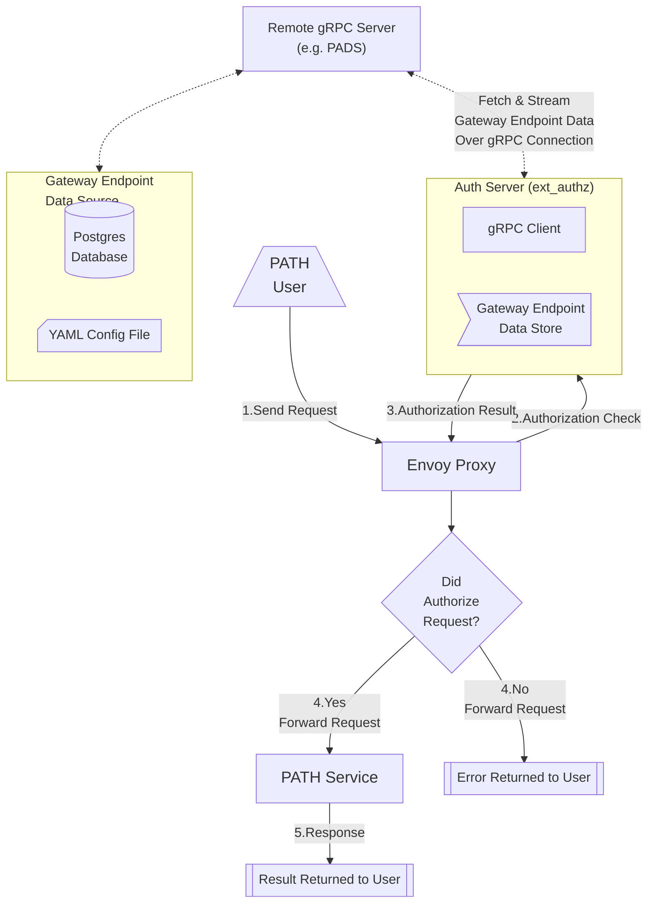
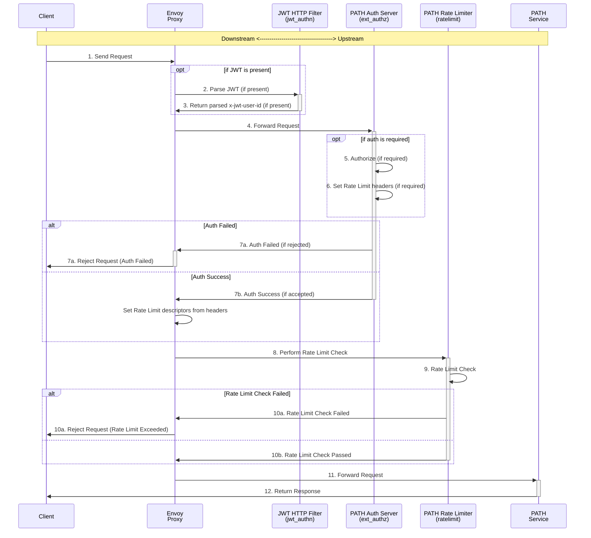
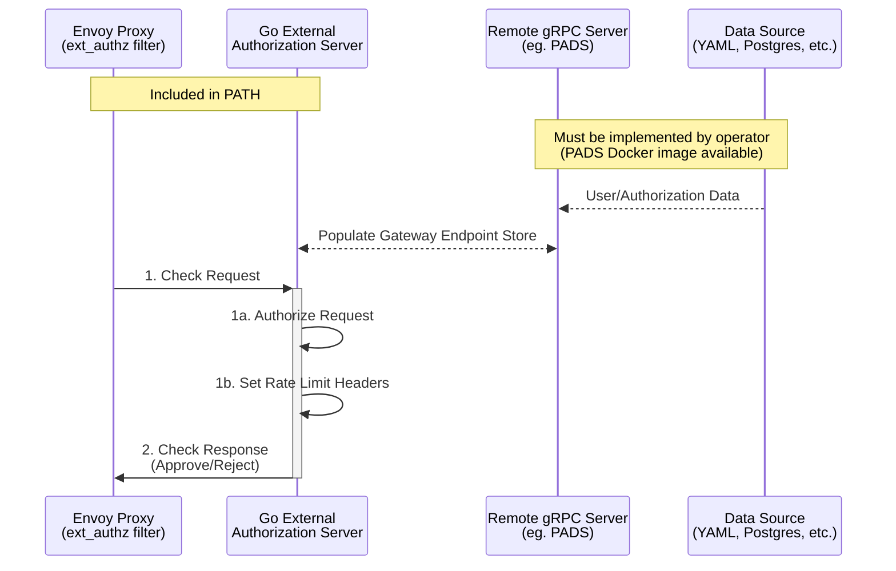

<div align="center">
<h1>PATH<br/>Authorization & Rate Limiting</h1>

</div>
<br/>

# Table of Contents <!-- omit in toc -->

- [1. Quickstart](#1-quickstart)
- [2. Overview](#2-overview)
  - [2.1. Components](#21-components)
  - [2.2 URL Format](#22-url-format)
- [3. Envoy Proxy](#3-envoy-proxy)
  - [3.1. Contents](#31-contents)
  - [3.2. Envoy HTTP Filters](#32-envoy-http-filters)
  - [3.3. Request Lifecycle](#33-request-lifecycle)
- [4. Gateway Endpoint Authorization](#4-gateway-endpoint-authorization)
  - [4.1 JSON Web Token (JWT) Authorization](#41-json-web-token-jwt-authorization)
  - [4.2 API Key Authorization](#42-api-key-authorization)
  - [4.3 No Authorization](#43-no-authorization)
- [5. External Authorization Server](#5-external-authorization-server)
  - [5.1. External Auth Service Sequence Diagram](#51-external-auth-service-sequence-diagram)
  - [5.2. External Auth Service Environment Variables](#52-external-auth-service-environment-variables)
  - [5.3. External Auth Service Getting Started](#53-external-auth-service-getting-started)
  - [5.4. Gateway Endpoints gRPC Service](#54-gateway-endpoints-grpc-service)
  - [5.5. Remote gRPC Auth Server](#55-remote-grpc-auth-server)
    - [5.2.1. PATH Auth Data Server](#521-path-auth-data-server)
    - [5.2.2. Gateway Endpoint YAML File](#522-gateway-endpoint-yaml-file)
    - [5.2.3. Implementing a Custom Remote gRPC Server](#523-implementing-a-custom-remote-grpc-server)
- [6. Rate Limiter](#6-rate-limiter)
  - [6.1. Rate Limit Configuration](#61-rate-limit-configuration)
  - [6.2. Documentation and Examples](#62-documentation-and-examples)

## 1. Quickstart

<!-- TODO_MVP(@commoddity): Prepare a cheatsheet version of this README and add a separate docusaurus page for it. -->

1. Install all prerequisites:

   - [Docker](https://docs.docker.com/get-docker/)
   - [Kind](https://kind.sigs.k8s.io/#installation-and-usage)
   - [Tilt](https://docs.tilt.dev/install.html)
   - [Helm](https://helm.sh/docs/intro/install/)

2. Run `make init_envoy` to create all the required config files

   - `envoy.yaml` is created with your auth provider's domain and audience.
   - `gateway-endpoints.yaml` is created from the example file in the [PADS Repository](https://github.com/buildwithgrove/path-auth-data-server/tree/main/yaml/testdata).
     - ℹ️ _Please update `gateway-endpoints.yaml` with your own data._

3. Run `make path_up` to start the services with all auth and rate limiting dependencies.

## 2. Overview

This folder contains everything necessary for managing authorization and rate limiting in the PATH service.
Specifically, this is split into two logical parts:

1. The `Envoy Proxy configuration`
2. The `Go External Authorization Server`

### 2.1. Components

> 💡 **Tip:** A [Tiltfile](https://github.com/buildwithgrove/path/blob/main/Tiltfile) is provided to run all of these services locally.

- **PATH Service**: The service that handles requests after they have been authorized.
- **Envoy Proxy**: A proxy server that handles incoming requests, performs auth checks, and routes authorized requests to the `PATH` service.
- **External Authorization Server**: A Go/gRPC server that evaluates whether incoming requests are authorized to access the `PATH` service.
- **Rate Limiter**: A service that coordinates all rate limiting.
- **Redis**: A key-value store used by the rate limiter to share state and coordinate rate limiting across any number of PATH instances behind the same Envoy Proxy.
- **Remote gRPC Server**: A server that provides the external authorization server with data on which endpoints are authorized to use the PATH service.
  - _PADS (PATH Auth Data Server) is provided as a functional implementation of the remote gRPC server that loads data from a YAML file or simple Postgres database._
  - _See [5.2.1. PATH Auth Data Server](#521-path-auth-data-server) for more information._



### 2.2 URL Format

When auth is enabled, the required URL format for the PATH service is:

```
https://<SERVICE_NAME>.<PATH_DOMAIN>/v1/<GATEWAY_ENDPOINT_ID>
```

For example, if the `SERVICE_NAME` is `eth` and the `GATEWAY_ENDPOINT_ID` is `a1b2c3d4`:

```
https://eth.rpc.grove.city/v1/a1b2c3d4
```

Requests are rejected if either of the following are true:

- The `<GATEWAY_ENDPOINT_ID>` is missing
- ID is not present in the `Go External Authorization Server`'s `Gateway Endpoint Store`

<br/>

## 3. Envoy Proxy

<div align="center">
  <a href="https://www.envoyproxy.io/docs/envoy/latest/">
    
  <p><b>Envoy Proxy Docs</b></p>
  </a>
</div>

PATH uses Envoy Proxy to handle authorization and rate limiting.

The `/envoy` directory houses the configuration files and settings for Envoy Proxy.

Envoy acts as a gateway, handling incoming requests, performing auth checks, and routing authorized requests to the PATH service.

### 3.1. Contents

- **ratelimit.yaml**: Configuration for the rate limiting service.
- **envoy.template.yaml**: A template configuration file for Envoy Proxy.
  - Run `make copy_envoy_config` to create `envoy.yaml`.
  - This will prompt you to enter your auth provider's domain and audience and will output the result to `envoy.yaml`.
  - `envoy.yaml` is Git ignored as it contains sensitive information.
- **gateway-endpoints.example.yaml**: An example file containing data on which endpoints are authorized to use the PATH service.
  - ℹ️ **ONLY REQUIRED** if loading `GatewayEndpoint` data from a YAML file and used to load data in the `external authorization server` from the `remote gRPC server`.
  - Run `make copy_envoy_gateway_endpoints` to create `gateway-endpoints.yaml`.
  - `gateway-endpoints.yaml` is Git ignored as it may contain sensitive information.

### 3.2. Envoy HTTP Filters

The PATH Auth Server uses the following [Envoy HTTP filters](https://www.envoyproxy.io/docs/envoy/latest/configuration/http/http_filters/http_filters) to handle authorization:

- **[header_mutation](https://www.envoyproxy.io/docs/envoy/latest/configuration/http/http_filters/header_mutation_filter)**: Ensures the request does not have the `x-jwt-user-id` header set before it is forwarded upstream.
- **[jwt_authn](https://www.envoyproxy.io/docs/envoy/latest/configuration/http/http_filters/jwt_authn_filter)**: Performs JWT verification and sets the `x-jwt-user-id` header.
- **[ext_authz](https://www.envoyproxy.io/docs/envoy/latest/configuration/http/http_filters/ext_authz_filter)**: Performs authorization checks using the PATH Auth Server external authorization server.
- **[ratelimit](https://www.envoyproxy.io/docs/envoy/latest/configuration/http/http_filters/rate_limit_filter)**: Performs rate limiting checks using the Rate Limiter service.

### 3.3. Request Lifecycle



## 4. Gateway Endpoint Authorization

The `Go External Authorization Server` evaluates whether incoming requests are authorized to access the PATH service based on the `AuthType` field of the `GatewayEndpoint` proto struct.

Three authorization types are supported:

1. [JSON Web Token (JWT) Authorization](#41-json-web-token-jwt-authorization)
2. [API Key Authorization](#42-api-key-authorization)
3. [No Authorization](#43-no-authorization)

### 4.1 JSON Web Token (JWT) Authorization

For GatewayEndpoints with the `AuthType` field set to `JWT_AUTH`, a valid JWT issued by the auth provider specified in the `envoy.yaml` file is required to access the PATH service.

_Example Request Header:_

```bash
-H "Authorization: Bearer <JWT>"
```

The `jwt_authn` filter will verify the JWT and, if valid, set the `x-jwt-user-id` header from the `sub` claim of the JWT. An invalid JWT will result in an error.

The `Go External Authorization Server` will use the `x-jwt-user-id` header to make an authorization decision; if the `GatewayEndpoint`'s `Auth.AuthorizedUsers` field contains the `x-jwt-user-id` value, the request will be authorized.

_Example auth provider user ID header:_

```
x-jwt-user-id: auth0|a12b3c4d5e6f7g8h9
```

> 💡 For more information, see the [Envoy JWT Authn Docs](https://www.envoyproxy.io/docs/envoy/latest/configuration/http/http_filters/jwt_authn_filter)

### 4.2 API Key Authorization

For GatewayEndpoints with the `AuthType` field set to `API_KEY_AUTH`, a static API key is required to access the PATH service.

_Example Request Header:_

```bash
-H "Authorization: <API_KEY>"
```

The `Go External Authorization Server` will use the `authorization` header to make an authorization decision; if the `GatewayEndpoint`'s `Auth.ApiKey` field matches the `API_KEY` value, the request will be authorized.

### 4.3 No Authorization

For GatewayEndpoints with the `AuthType` field set to `NO_AUTH`, no authorization is required to access the PATH service.

All requests for GatewayEndpoints with the `AuthType` field set to `NO_AUTH` will be authorized by the `Go External Authorization Server`.

## 5. External Authorization Server

> 💡 See [PATH PADS Repository](https://github.com/buildwithgrove/path-auth-data-server) for more information on authorization service provided by Grove for PATH support.

The `envoy/auth_server` directory contains the `Go External Authorization Server` called by the Envoy `ext_authz` filter. It evaluates whether incoming requests are authorized to access the PATH service.

This server communicates with a `Remote gRPC Server` to populate its in-memory `Gateway Endpoint Store`, which provides data on which endpoints are authorized to use the PATH service.

### 5.1. External Auth Service Sequence Diagram



### 5.2. External Auth Service Environment Variables

The external authorization server requires the following environment variables to be set:

- `GRPC_HOST_PORT`: The host and port of the remote gRPC server.
- `GRPC_USE_INSECURE`: Set to `true` if the remote gRPC server does not use TLS (default: `false`).

### 5.3. External Auth Service Getting Started

Run `make copy_envoy_env` to create the `.env` file needed to run the external authorization server locally.

For more information, see:

- [Envoy External Authorization Docs](https://www.envoyproxy.io/docs/envoy/latest/configuration/http/http_filters/ext_authz_filter)
- [Envoy Go Control Plane Auth Package](https://pkg.go.dev/github.com/envoyproxy/go-control-plane@v0.13.0/envoy/service/auth/v3)

### 5.4. Gateway Endpoints gRPC Service

Both the `Go External Authorization Server` and the `Remote gRPC Server` use the gRPC service and types defined in the [`gateway_endpoint.proto`](https://github.com/buildwithgrove/path/blob/main/envoy/auth_server/proto/gateway_endpoint.proto) file.

This service defines two main methods for populating the `Go External Authorization Server`'s `Gateway Endpoint Store`:

```proto
service GatewayEndpoints {
  // GetInitialData requests the initial set of GatewayEndpoints from the remote gRPC server.
  rpc GetInitialData(InitialDataRequest) returns (InitialDataResponse);

  // StreamUpdates listens for updates from the remote gRPC server and streams them to the client.
  rpc StreamUpdates(UpdatesRequest) returns (stream Update);
}
```

### 5.5. Remote gRPC Auth Server

The `Remote gRPC Server` is responsible for providing the `Go External Authorization Server` with data on which endpoints are authorized to use the PATH service.

> ℹ️ **Note:** The implementation of the remote gRPC server is up to the Gateway operator but PADS is provided as a functional implementation for most users.

#### 5.2.1. PATH Auth Data Server

[The PADS repo provides a functioning implementation of the remote gRPC server.](https://github.com/buildwithgrove/path-auth-data-server)

This service is available as a Docker image and may be configured to load data from a YAML file or using a simple Postgres database that adheres to the provided minimal schema.

**Docker Image Registry:**

```bash
ghcr.io/buildwithgrove/path-auth-data-server:latest
```

_This Docker image is loaded by default in the [Tiltfile](https://github.com/buildwithgrove/path/blob/main/Tiltfile) file at the root of the PATH repo._

If the Gateway Operator wishes to implement a custom remote gRPC server, see the [Implementing a Custom Remote gRPC Server](#523-implementing-a-custom-remote-grpc-server) section.

#### 5.2.2. Gateway Endpoint YAML File

_`PADS` loads data from the Gateway Endpoints YAML file specified by the `YAML_FILEPATH` environment variable._

[An example `gateway-endpoints.yaml` file may be seen in the PADS repo](https://github.com/buildwithgrove/path-auth-data-server/blob/main/yaml/testdata/gateway-endpoints.example.yaml).

The yaml file below provides an example for a particular gateway operator where:

- `endpoint_1` is authorized with a static API Key
- `endpoint_2` is authorized using an auth-provider issued JWT for two users
- `endpoint_3` requires no authorization and has a rate limit set

```yaml
endpoints:
  # 1. Example of a gateway endpoint using API Key Authorization
  endpoint_1:
    auth:
      auth_type: "AUTH_TYPE_API_KEY"
      api_key: "api_key_1"

  # 2. Example of a gateway endpoint using JWT Authorization
  endpoint_2:
    auth:
      auth_type: "AUTH_TYPE_JWT"
      jwt_authorized_users:
        - "auth0|user_1"
        - "auth0|user_2"

  # 3. Example of a gateway endpoint with no authorization and rate limiting set
  endpoint_3:
    rate_limiting:
      throughput_limit: 30
      capacity_limit: 100000
      capacity_limit_period: "CAPACITY_LIMIT_PERIOD_MONTHLY"
```

> 💡 **TIP:** The PADS repo also provides a [YAML schema for the `gateway-endpoints.yaml` file](https://github.com/buildwithgrove/path-auth-data-server/blob/main/yaml/gateway-endpoints.schema.yaml), which can be used to validate the configuration.

#### 5.2.3. Implementing a Custom Remote gRPC Server

If the Gateway operator wishes to implement a custom remote gRPC server, the implementation must import the Go `github.com/buildwithgrove/path/envoy/auth_server/proto` package, which is autogenerated from the [`gateway_endpoint.proto`](https://github.com/buildwithgrove/path/blob/main/envoy/auth_server/proto/gateway_endpoint.proto) file.

The custom implementation must use the methods defined in the `GatewayEndpoints` service:

- `FetchAuthDataSync`
- `StreamAuthDataUpdates`

> 💡 **TIP:** Forking the PADS repo is the easiest way to get started, though any gRPC server implementation that adheres to the `gateway_endpoint.proto` service definition should suffice.

## 6. Rate Limiter

### 6.1. Rate Limit Configuration

1. The `Go External Authorization Server` sets the `x-rl-endpoint-id` and `x-rl-plan` headers if the `GatewayEndpoint` for the request should be rate limited.

2. Envoy Proxy is configured to forward the `x-rl-endpoint-id` and `x-rl-plan` headers to the rate limiter service as descriptors.

   _envoy.yaml_

   ```yaml
   rate_limits:
     - actions:
         - request_headers:
             header_name: "x-rl-endpoint-id"
             descriptor_key: "x-rl-endpoint-id"
         - request_headers:
             header_name: "x-rl-plan"
             descriptor_key: "x-rl-plan"
   ```

3. Rate limiting is configured through the [`/envoy/ratelimit.yaml`](https://github.com/buildwithgrove/path/blob/main/envoy/ratelimit.yaml) file.

   _ratelimit.yaml_

   ```yaml
   domain: rl
   descriptors:
     - key: x-rl-endpoint-id
       descriptors:
         - key: x-rl-plan
           value: "PLAN_FREE"
           rate_limit:
             unit: second
             requests_per_unit: 30
   ```

   > 💡 **NOTE:** The default throughput limit is **30 requests per second** for GatewayEndpoints with the `PLAN_FREE` plan type based on the `x-rl-endpoint-id` and `x-rl-plan` descriptors.

   _The rate limiting configuration may be configured to suit the needs of the Gateway Operator in the `ratelimit.yaml` file._

### 6.2. Documentation and Examples

As Envoy's rate limiting configuration is fairly complex, this blog article provides a good overview of the configuration options:

- [Understanding Envoy Rate Limits](https://www.aboutwayfair.com/tech-innovation/understanding-envoy-rate-limits)

For more advanced configuration options, refer to the Envoy documentation:

- [Envoy Proxy Rate Limit Docs](https://www.envoyproxy.io/docs/envoy/latest/configuration/http/http_filters/rate_limit_filter)

- [Envoy Rate Limit Github](https://github.com/envoyproxy/ratelimit)
