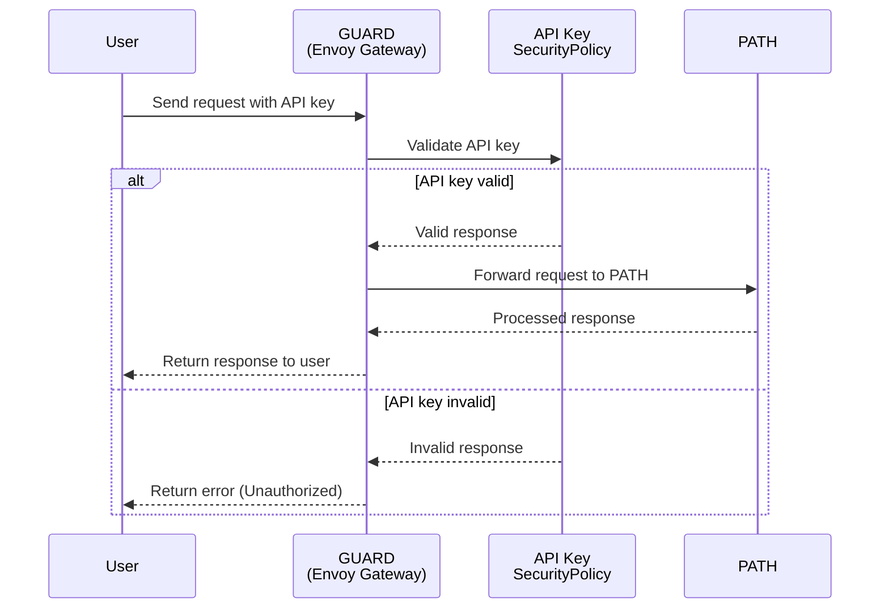

<h1>GUARD Gateway Utilities for Authentication, Routing & Defense</h1>

 

## Table of Contents <!-- omit in toc -->

- [Introduction](#introduction)
  - [Envoy Gateway](#envoy-gateway)
  - [Request Flow](#request-flow)

# Introduction

GUARD is the web2 gateway layer for PATH. It is responsible for authentication, rate limiting, and routing of incoming web traffic to the backend PATH service.

It uses Envoy Gateway as the underlying proxy and is configured through a Helm chart.

## Envoy Gateway

  
   
  <a href="https://gateway.envoyproxy.io/docs/">
    <h2>Envoy Gateway Docs</h2>
  </a>

:::info From Envoy Gateway's Documentation

_Envoy Gateway is an open source project for managing Envoy Proxy as a standalone or Kubernetes-based application gateway. Gateway API resources are used to dynamically provision and configure the managed Envoy Proxies._

:::

  
  <h2>Envoy Gateway</h2>

- [Envoy Gateway Resources](https://gateway.envoyproxy.io/docs/concepts/concepts_overview/)

## Request Flow

