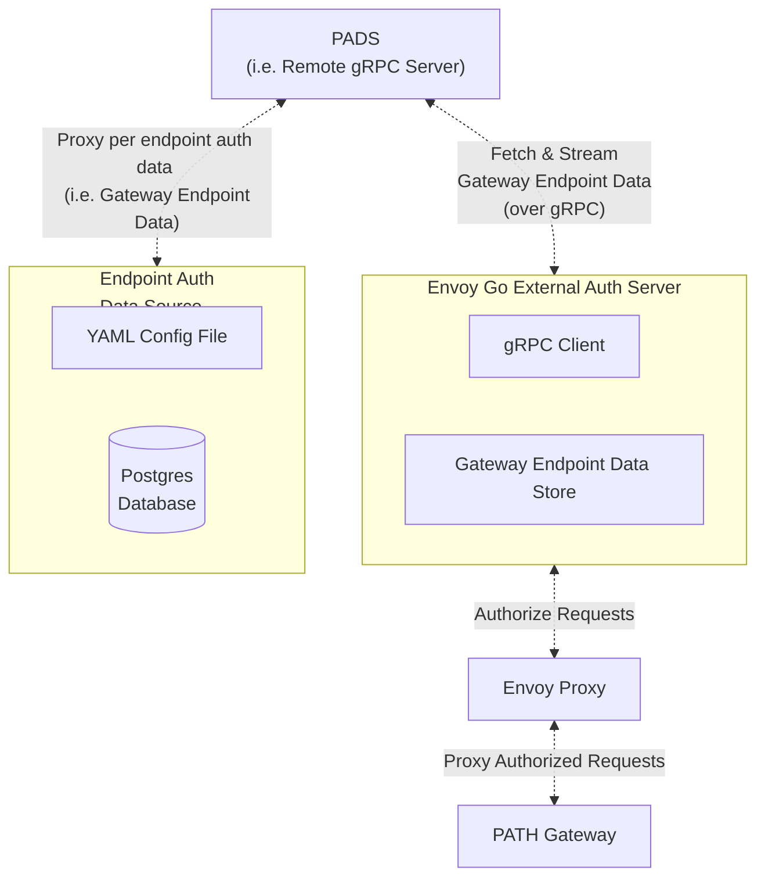

<div align="center">
<h1>PADS<br/>PATH Auth Data Server</h1>


</div>
<br/>


## Table of Contents <!-- omit in toc -->

- [Introduction](#introduction)
- [Gateway Endpoint Protobuf Definition](#gateway-endpoint-protobuf-definition)
  - [Core Fields](#core-fields)
  - [Auth Types](#auth-types)
  - [Rate Limiting Configuration](#rate-limiting-configuration)
  - [Metadata Fields](#metadata-fields)
- [Auth Data Source Abstraction: Go interface to gRPC service](#auth-data-source-abstraction-go-interface-to-grpc-service)
  - [PADS go Interface](#pads-go-interface)
  - [PATH gRPC Interface](#path-grpc-interface)

## Introduction

<!-- TODO_MVP(@commoddity): Move these documents over to path.grove.city -->

**PADS** (PATH Auth Data Server) is an opinionated implementation of an authorization data server for PATH users. It provides authorization data on a per endpoint basis from an external data source for [the PATH Gateway](https://github.com/buildwithgrove/path).

Gateway Operators who want to enable authorization for their services are encouraged to use it
as a starting point, but can implement their own as well.

The nature of the data source is configurable. For example it could be a **static YAML file** or a **Postgres database**.



## Gateway Endpoint Protobuf Definition

:::tip

See the [Envoy Section](../envoy/introduction.md#external-auth-server) of the PATH documentation for complete details.

:::

A `GatewayEndpoint` represents a single endpoint managed by the Gateway. It can be configured to be public or authorized to support one or more user accounts.

The complete protobuf definitions can be found in the [`gateway_endpoint.proto`](https://github.com/buildwithgrove/path/blob/main/envoy/auth_server/proto/gateway_endpoint.proto) file.

### Core Fields

| Field           | Type         | Required | Default | Description                                                               |
| --------------- | ------------ | -------- | ------- | ------------------------------------------------------------------------- |
| `endpoint_id`   | string       | Yes      | -       | Unique identifier used in the request URL path (e.g. `/v1/{endpoint_id}`) |
| `auth`          | Auth         | Yes      | -       | Authorization configuration for the endpoint                              |
| `rate_limiting` | RateLimiting | No       | -       | Rate limit settings for request throughput and capacity                   |
| `metadata`      | Metadata     | No       | -       | Optional fields for billing, metrics and observability                    |

### Auth Types

| Field            | Type         | Required | Default | Description                                |
| ---------------- | ------------ | -------- | ------- | ------------------------------------------ |
| `no_auth`        | NoAuth       | No       | -       | Endpoint requires no authorization         |
| `static_api_key` | StaticAPIKey | No       | -       | Uses a `Static API` key for auth           |
| `jwt`            | JWT          | No       | -       | Uses `JWT` with map of authorized user IDs |

### Rate Limiting Configuration

| Field                   | Type  | Required | Default     | Description                                      |
| ----------------------- | ----- | -------- | ----------- | ------------------------------------------------ |
| `throughput_limit`      | int32 | No       | 0           | Requests per second (TPS) limit                  |
| `capacity_limit`        | int32 | No       | 0           | Total request capacity limit                     |
| `capacity_limit_period` | enum  | No       | UNSPECIFIED | Period for capacity limit (DAILY/WEEKLY/MONTHLY) |

### Metadata Fields

| Field         | Type   | Required | Default | Description                                                          |
| ------------- | ------ | -------- | ------- | -------------------------------------------------------------------- |
| `name`        | string | No       | ""      | Name of the endpoint                                                 |
| `account_id`  | string | No       | ""      | User account identifier                                              |
| `user_id`     | string | No       | ""      | Specific user identifier                                             |
| `plan_type`   | string | No       | ""      | Subscription plan (e.g. `Free`, `Pro`, `Enterprise`)                 |
| `email`       | string | No       | ""      | Associated email address of `account_id` owner                       |
| `environment` | string | No       | ""      | Deployment environment (e.g. `development`, `staging`, `production`) |

## Auth Data Source Abstraction: Go interface to gRPC service

[**PADS**](https://github.com/buildwithgrove/path-auth-data-server/) defines an `AuthDataSource` interface in [`grpc/data_source.go`](https://github.com/buildwithgrove/path-auth-data-server/blob/main/grpc/data_source.go).

This interface is abstracted via the `gRPC Service` named `GatewayEndpoints` in [`gateway_endpoints.proto`](https://github.com/buildwithgrove/path-auth-data-server/blob/main/grpc/gateway_endpoints.proto).

Together, this is used to stream data from **Endpoint Auth Data Source** to the **Envoy Go External Auth Server** seen in the diagram above.

### PADS go Interface

```go
type AuthDataSource interface {
   FetchAuthDataSync() (*proto.AuthDataResponse, error)
   AuthDataUpdatesChan() (<-chan *proto.AuthDataUpdate, error)
}
```

| Function                | Returns                             | Details                                                               |
| ----------------------- | ----------------------------------- | --------------------------------------------------------------------- |
| `FetchAuthDataSync()`   | Full set of Gateway Endpoints       | Called when `PADS` starts to populate its Gateway Endpoint Data Store |
| `AuthDataUpdatesChan()` | Channel receiving auth data updates | Updates are streamed as changes are made to the data source           |

### PATH gRPC Interface

:::info gRPC Proto File Documentation

See the [`gateway_endpoint.proto` ](../envoy/introduction.md#gateway_endpointproto-file) documentation for complete details.

:::

```protobuf
service GatewayEndpoints {
  rpc FetchAuthDataSync(AuthDataRequest) returns (AuthDataResponse);
  rpc StreamAuthDataUpdates(AuthDataUpdatesRequest) returns (stream AuthDataUpdate);
}
```

| Method                  | Request                  | Response                | Description                                                          |
| ----------------------- | ------------------------ | ----------------------- | -------------------------------------------------------------------- |
| `FetchAuthDataSync`     | `AuthDataRequest`        | `AuthDataResponse`      | Fetches initial set of GatewayEndpoints from remote gRPC server      |
| `StreamAuthDataUpdates` | `AuthDataUpdatesRequest` | Stream `AuthDataUpdate` | Streams real-time updates of GatewayEndpoint changes from the server |
