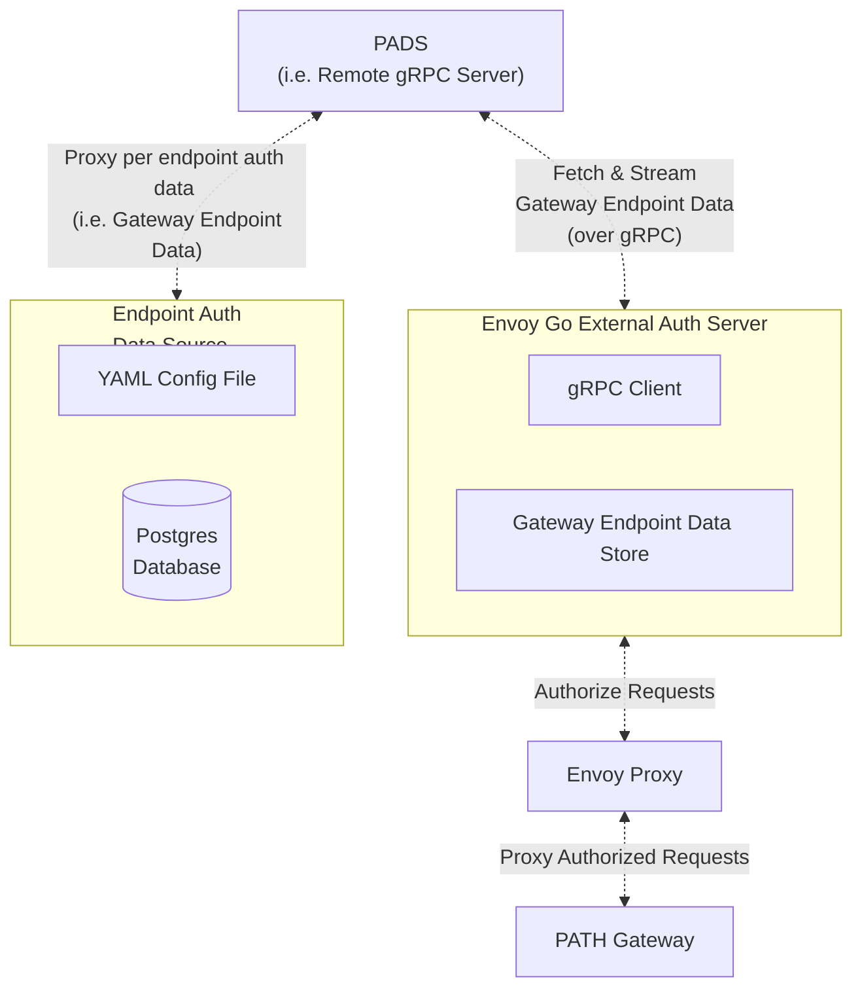

<h1>PADS PATH Auth Data Server</h1>

 

## Introduction

**PADS** (PATH Auth Data Server) is an opinionated implementation of an authorization data server for PATH users. It provides authorization data on a per endpoint basis from an external data source for [the PATH Gateway](https://github.com/buildwithgrove/path).

Gateway Operators who want to enable authorization for their services are encouraged to use it
as a starting point, but can implement their own as well.

The nature of the data source is configurable. For example it could be a **static YAML file** or a **Postgres database**.

