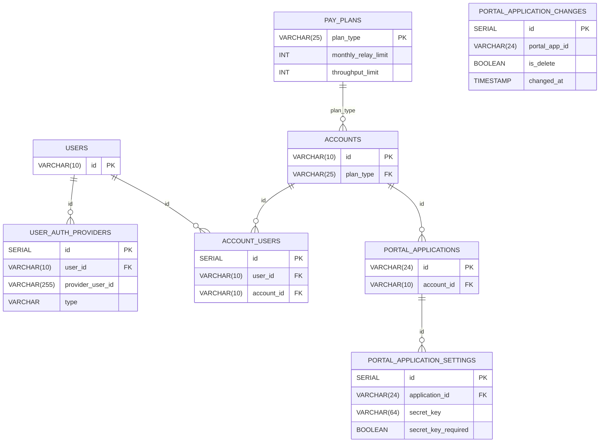

If the `POSTGRES_CONNECTION_STRING` environment variable is set, PADS will connect to the specified Postgres database.

Postgres triggers are configured to stream updates to the `Go External Authorization Server` in real time as changes are made to the connected Postgres database.

# Table of Contents <!-- omit in toc -->

- [Grove Portal DB Driver](#grove-portal-db-driver)
  - [Entity Relationship Diagram](#entity-relationship-diagram)
  - [SQLC Autogeneration](#sqlc-autogeneration)
- [Additional Postgres Implementations](#additional-postgres-implementations)

## Grove Portal DB Driver

<a href="https://www.postgresql.org/">

https://www.postgresql.org/

</a>

 

The [Grove Postgres Driver schema file](https://github.com/buildwithgrove/path-auth-data-server/blob/main/postgres/grove/sqlc/grove_schema.sql)
uses a subset of tables from the existing Grove Portal database schema, allowing `PATH` to source its authorization data from the existing Grove Portal DB.

It converts the data stored in the `portal_applications` table and its associated tables into the `proto.GatewayEndpoint` format expected by PATH's Go External Authorization Server.

It also listens for updates to the Grove Portal DB and streams updates to the `Go External Authorization Server` in real time as changes are made to the connected Postgres database.

[For the full Grove Portal DB schema, refer to the database schema defined in the Portal HTTP DB (PHD) repository](https://github.com/pokt-foundation/portal-http-db/blob/master/postgres-driver/sqlc/schema.sql).

### Entity Relationship Diagram

This ERD shows the subset of tables from the full Grove Portal DB schema that are used by the Grove Postgres Driver in PADS.

### SQLC Autogeneration

<a href="https://docs.sqlc.dev/en/stable">

https://docs.sqlc.dev/en/stable

</a>

 

The Postgres Driver uses `SQLC` to autogenerate the Postgres Go code needed to interact with the Postgres database/

The Make target `make gen_sqlc` will regenerate the Go code from the SQLC schema file.

This will output code autogenerated from the [postgres/grove/sqlc/grove_schema.sql](https://github.com/buildwithgrove/path-auth-data-server/blob/main/postgres/grove/sqlc/grove_schema.sql)
and [postgres/grove/sqlc/grove_queries.sql](https://github.com/buildwithgrove/path-auth-data-server/blob/main/postgres/grove/sqlc/grove_queries.sql) files
to the [postgres/grove/sqlc](https://github.com/buildwithgrove/path-auth-data-server/blob/main/postgres/grove/sqlc) directory.

`SQLC` configuration is defined in the [postgres/sqlc/sqlc.yaml](https://github.com/buildwithgrove/path-auth-data-server/blob/main/postgres/grove/sqlc/sqlc.yaml) file.

## Additional Postgres Implementations

Pull requests are welcome to support alternative Postgres data sources, with the requirement that they support [the gRPC spec referenced in the `gateway_endpoint.proto` file](../envoy/introduction.md#gateway_endpointproto-file).

Alternatively, you may fork [the PADS repository](https://github.com/buildwithgrove/path-auth-data-server) and implement your own data source.

