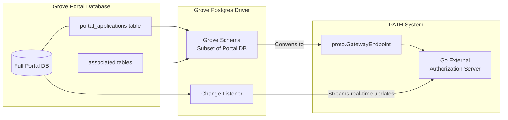
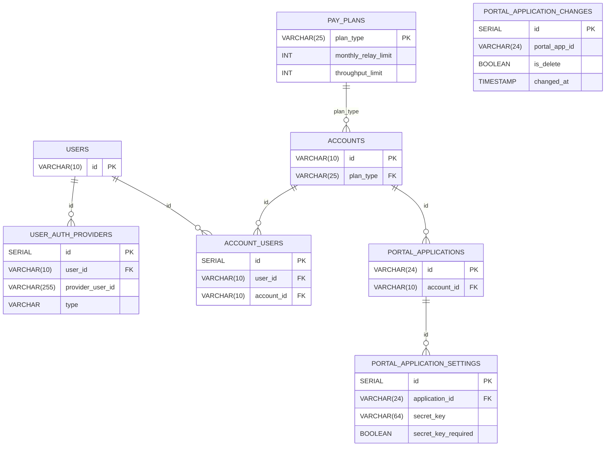
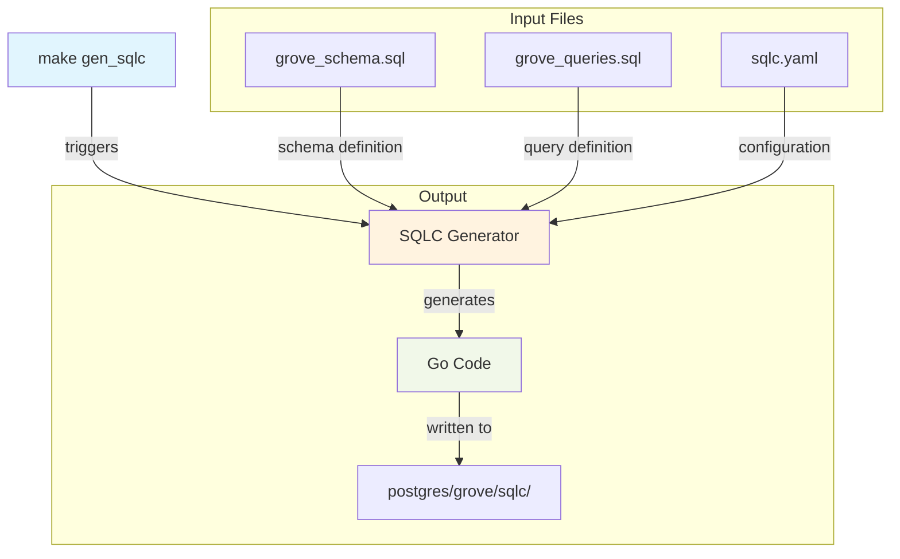

If the `POSTGRES_CONNECTION_STRING` environment variable is set, **PADS** will connect to the specified Postgres database.

**Postgres triggers are configured to stream updates** to the `Go External Authorization Server` in real time as changes are made to the connected Postgres database.

## Grove Portal DB Driver Background

<a href="https://www.postgresql.org/">

https://www.postgresql.org/

</a>

 

:::info
The database driver implemented is an **extremely opinionated** implementation designed
for backwards compatibility with [Grove's Portal](https://portal.grove.city/).
:::

The [Grove Postgres Driver schema file](https://github.com/buildwithgrove/path-auth-data-server/blob/main/postgres/grove/sqlc/grove_schema.sql)
uses a subset of tables from the existing Grove Portal database schema, allowing `PATH` to source its authorization data from the existing Grove Portal DB.

It converts the data stored in the `portal_applications` table and its associated tables into the `proto.GatewayEndpoint` format expected by PATH's `Go External Authorization Server`.

It also listens for updates to the Grove Portal DB and streams updates to the `Go External Authorization Server` in real time as changes are made to the connected Postgres database.

The full Grove Portal DB schema is defined in the [Portal HTTP DB (PHD) repository](https://github.com/pokt-foundation/portal-http-db/blob/master/postgres-driver/sqlc/schema.sql).

### Entity Relationship Diagram

This ERD shows the subset of tables from the full Grove Portal DB schema that are used by the Grove Postgres Driver in PADS.

### SQLC Autogeneration

<a href="https://docs.sqlc.dev/en/stable">

https://docs.sqlc.dev/en/stable

</a>

 

The Postgres Driver uses `SQLC` to automatically convert SQL definitions into Go code.

The process is started by running `make gen_sqlc`, which reads two main SQL files:

1. [`grove_schema.sql`](https://github.com/buildwithgrove/path-auth-data-server/blob/main/postgres/grove/sqlc/grove_schema.sql): Defines the database structure
2. [`grove_queries.sql`](https://github.com/buildwithgrove/path-auth-data-server/blob/main/postgres/grove/sqlc/grove_queries.sql): Contains the database queries

Using the configuration in [sqlc.yaml](https://github.com/buildwithgrove/path-auth-data-server/blob/main/postgres/grove/sqlc/sqlc.yaml), SQLC generates the corresponding Go code and outputs it to the [postgres/grove/sqlc directory](https://github.com/buildwithgrove/path-auth-data-server/blob/main/postgres/grove/sqlc).

## Additional Postgres Implementations

As mentioned above, this is an **extremely opinionated** implementation designed for backwards compatibility with [Grove's Portal](https://portal.grove.city/).

Pull requests are welcome to support alternative Postgres data sources.

The only requirement is that the gRPC service definition in [`gateway_endpoint.proto`](https://github.com/buildwithgrove/path/blob/main/envoy/auth_server/proto/gateway_endpoint.proto) must be supported.

Alternatively, you may fork the [PADS repository](https://github.com/buildwithgrove/path-auth-data-server) and implement your own data source.
