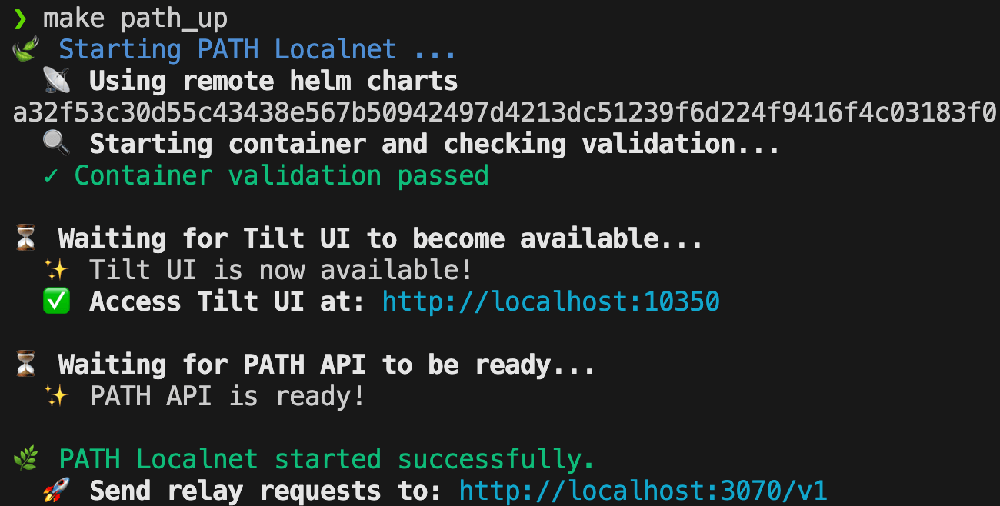
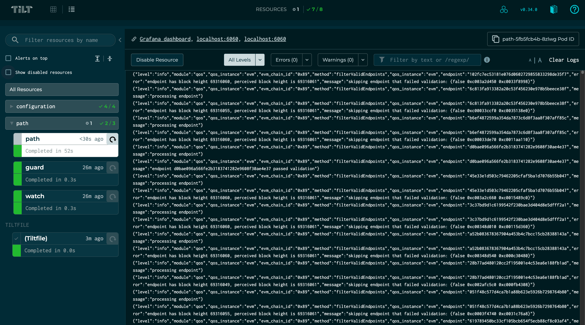

Set up `PATH` with Pocket Network's **Shannon** protocol.

Shannon status: Beta TestNet (01/2025), Private MainNet (04/2025).

## Grove Employees: Quick Config

1. Download the preferred config file from 1Password:
   - **[Shannon MainNet](https://start.1password.com/open/i?a=4PU7ZENUCRCRTNSQWQ7PWCV2RM&v=kudw25ob4zcynmzmv2gv4qpkuq&i=4ifsnkuifvaggwgptns6xyglsa&h=buildwithgrove.1password.com)** - For testing on MainNet
   - **[Shannon Beta TestNet](https://start.1password.com/open/i?a=4PU7ZENUCRCRTNSQWQ7PWCV2RM&v=kudw25ob4zcynmzmv2gv4qpkuq&i=3treknedz5q47rgwdbreluwffu&h=buildwithgrove.1password.com)** - For testing on Beta TestNet
2. Copy to `local/path/.config.yaml` **in your PATH repository**
3. Skip to [section 3: Run PATH](#3-run-path-in-development-mode)

:::tip Skip to section 2.1

Coming from the [App & PATH Gateway Cheat Sheet](https://dev.poktroll.com/operate/cheat_sheets/gateway_cheatsheet)? Start at [2.1 Generate Shannon Config](#21-generate-shannon-config).

:::

## Table of Contents <!-- omit in toc -->

- [0. Prerequisites](#0-prerequisites)
- [1. Setup Shannon Protocol Accounts (Gateway \& Application)](#1-setup-shannon-protocol-accounts-gateway--application)
  - [1.1 Gateway and Application Account Creation](#11-gateway-and-application-account-creation)
  - [1.2 `Application` and `Gateway` Account Validation](#12-application-and-gateway-account-validation)
- [2. Configure PATH for Shannon](#2-configure-path-for-shannon)
  - [2.1 Generate Shannon Config](#21-generate-shannon-config)
  - [2.2 Manual Configuration Verification](#22-manual-configuration-verification)
  - [2.3 Ensure onchain configuration matches](#23-ensure-onchain-configuration-matches)
  - [2.4 (Optional) Disable QoS Hydrator Checks](#24-optional-disable-qos-hydrator-checks)
- [3. Run PATH in development mode](#3-run-path-in-development-mode)
  - [3.1 Start PATH](#31-start-path)
  - [3.2 Monitor PATH](#32-monitor-path)
- [4. Test Relays](#4-test-relays)
  - [Test Relay with `curl`](#test-relay-with-curl)
  - [Test Relay with `make`](#test-relay-with-make)
  - [Load Testing with `relay-util`](#load-testing-with-relay-util)
- [5. Stop PATH](#5-stop-path)

## 0. Prerequisites

Complete the [**Quick Start**](1_quick_start.md) guide.

## 1. Setup Shannon Protocol Accounts (Gateway & Application)

You need:
1. **[Gateway](https://docs.pokt.network/pokt-protocol/the-shannon-upgrade/shannon-actors/gateways)**: Facilitates relays and ensures QoS
2. **[Application](https://docs.pokt.network/pokt-protocol/the-shannon-upgrade/shannon-actors/sovereign-applications)**: Pays for relays (API key holder)

### 1.1 Gateway and Application Account Creation

**Recommended**: Follow the [**App & PATH Gateway Cheat Sheet**](https://dev.poktroll.com/operate/cheat_sheets/gateway_cheatsheet) for complete setup.

**Quick setup** (first-time users):

<details>

<summary>Copy-pasta to stake onchain Application & Gateway</summary>

**Create gateway stake config:**

```bash
cat <<🚀 > /tmp/stake_gateway_config.yaml
stake_amount: 1000000upokt
🚀
```

**Create application stake config:**

```bash
cat <<🚀 > /tmp/stake_app_config.yaml
stake_amount: 100000000upokt
service_ids:
  - "anvil"
🚀
```

**Create accounts:**

```bash
pocketd keys add gateway
pocketd keys add application
```

**Fund accounts**: Use faucet links [here](https://dev.poktroll.com/category/explorers-faucets-wallets-and-more).

:::tip Grove employees only

Fund using `pkd_beta_tx` helper ([instructions](https://www.notion.so/buildwithgrove/Shannon-Alpha-Beta-Environment-rc-helpers-152a36edfff680019314d468fad88864?pvs=4)):

```bash
pkd_beta_tx bank send faucet_beta $(pkd keys show -a application) 6900000000042upokt
pkd_beta_tx bank send faucet_beta $(pkd keys show -a gateway) 6900000000042upokt
```

:::

**Stake gateway:**

```bash
pocketd tx gateway stake-gateway \
 --config=/tmp/stake_gateway_config.yaml \
 --from=gateway --gas=auto --gas-prices=200upokt --gas-adjustment=1.5 --chain-id=pocket-beta \
 --node=https://shannon-testnet-grove-rpc.beta.poktroll.com \
 --yes
```

**Stake application:**

```bash
pocketd tx application stake-application \
 --config=/tmp/stake_app_config.yaml \
 --from=application --gas=auto --gas-prices=200upokt --gas-adjustment=1.5 --chain-id=pocket-beta \
 --node=https://shannon-testnet-grove-rpc.beta.poktroll.com \
 --yes
```

**Delegate application to gateway:**

```bash
pocketd tx application delegate-to-gateway $(pocketd keys show -a gateway) \
 --from=application --gas=auto --gas-prices=200upokt --gas-adjustment=1.5 --chain-id=pocket-beta \
 --node=https://shannon-testnet-grove-rpc.beta.poktroll.com \
 --yes
```

</details>

### 1.2 Account Validation

Verify your keys:

```bash
# All accounts
pocketd keys list

# Gateway only
pocketd keys show -a gateway

# Application only
pocketd keys show -a application
```

## 2. Configure PATH for Shannon

### 2.1 Generate Shannon Config

Generate config at `local/path/.config.yaml`:

```bash
make shannon_populate_config
```

:::important Environment variables

Override defaults if needed:

- `POCKETD_HOME`: Path to pocketd home (default `$HOME/.pocketd`)
- `POCKETD_KEYRING_BACKEND`: Keyring backend (default `test`)

:::

### 2.2 Manual Configuration Verification

Check config:

```bash
cat local/path/.config.yaml
```

Expected format:

```yaml
shannon_config:
  full_node_config:
    rpc_url: https://shannon-testnet-grove-rpc.beta.poktroll.com
    grpc_config:
      host_port: shannon-testnet-grove-grpc.beta.poktroll.com:443
    lazy_mode: false
  gateway_config:
    gateway_mode: "centralized"
    gateway_address: pokt1... # Your gateway address
    gateway_private_key_hex: "0x..." # Your gateway private key
    owned_apps_private_keys_hex:
      - "0x..." # Your application private key
```

### 2.3 Ensure onchain configuration matches

Verify service configuration for each application:

```bash
pocketd query application show-application \
     $(pkd keys show -a application) \
     --node=https://shannon-testnet-grove-rpc.beta.poktroll.com
```

### 2.4 (Optional) Disable QoS Hydrator Checks

QoS hydrator runs checks on all configured services by default.

To disable for specific services, add `qos_disabled_service_ids` to `.config.yaml`.

**Use cases**: Testing and development.

**More info**:
- [PATH Configuration File](./8_ref_configurations_path.md#hydrator_config-optional)
- [Supported QoS Services](../../learn/qos/1_supported_services.md)

:::tip

Check configured services:

```bash
curl http://localhost:3069/healthz
```

:::

## 3. Run PATH in development mode

### 3.1 Start PATH

Start PATH in Tilt:

```bash
make path_up
```

### 3.2 Monitor PATH

:::warning Grab a ☕
First startup takes a few minutes for `path`, `guard` and `watch`.
:::

**Console output** (~30 seconds):



**Tilt dashboard**: Visit [localhost:10350](<http://localhost:10350/r/(all)/overview>)



## 4. Test Relays

:::warning Anvil Node & Request Retries

Retry requests if first attempt fails. `anvil` node may not always be available.

:::

### Test Relay with `curl`

Test block height:

```bash
curl http://localhost:3070/v1 \
 -H "Target-Service-Id: anvil" \
 -H "Authorization: test_api_key" \
 -d '{"jsonrpc": "2.0", "id": 1, "method": "eth_blockNumber" }'
```

Expected response:

```json
{"id":1,"jsonrpc":"2.0","result":"0x2f01a"}%
```

### Test Relay with `make`

Use makefile helpers (see `makefiles/test_requests.mk`):

```bash
make test_request__shannon_service_id_header
```

View all helpers:

```bash
make help
```

### Load Testing with `relay-util`

Send 100 requests with performance metrics:

```bash
make test_request__shannon_relay_util_100
```

:::note TODO: Screenshots

Add screenshot of output.

:::

## 5. Stop PATH

When you're finished testing and want to stop PATH:

```bash
make path_down
```
