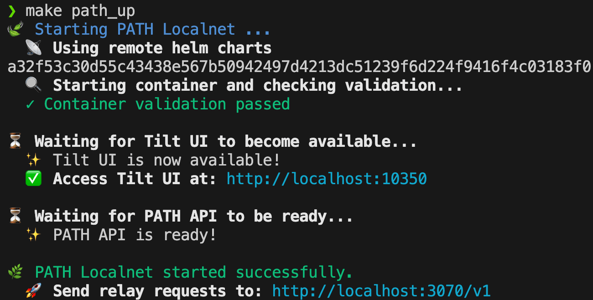

This guide covers setting up `PATH` with the **Shannon** protocol.

Shannon is in Beta TestNet as of 01/2025 and private MainNet as of 04/2025.

## Table of Contents <!-- omit in toc -->

- [0. Prerequisites](#0-prerequisites)
- [1. Setup Shannon Protocol Accounts (Gateway \& Application)](#1-setup-shannon-protocol-accounts-gateway--application)
  - [1.1 Gateway and Application Account Creation](#11-gateway-and-application-account-creation)
  - [1.2 `Application` and `Gateway` Account Validation](#12-application-and-gateway-account-validation)
- [2. Configure PATH for Shannon](#2-configure-path-for-shannon)
  - [2.1 Generate Shannon Config](#21-generate-shannon-config)
  - [2.2 Verify Configuration](#22-verify-configuration)
- [3. Run PATH in development mode](#3-run-path-in-development-mode)
- [3.1 Start PATH](#31-start-path)
  - [3.1 Monitor PATH](#31-monitor-path)
- [4. Test Relays](#4-test-relays)
- [What's Next?](#whats-next)

## 0. Prerequisites

1. Prepare your environment by following the instructions in the [**environment setup**](2_environment.md) guide.
2. Install the [**`pocketd` CLI**](https://dev.poktroll.com/tools/user_guide/pocketd_cli) to interact with [Pocket Network's Shannon Upgrade](https://dev.poktroll.com).

:::tip

You can use the `make install_deps` command to install the dependencies for the PATH stack, including the `pocketd` CLI.

:::

## 1. Setup Shannon Protocol Accounts (Gateway & Application)

Before starting, you'll need to create and configure:

1. An onchain [**Gateway**](https://docs.pokt.network/pokt-protocol/the-shannon-upgrade/shannon-actors/gateways): An onchain actor that **facilitates** _(i.e. proxies)_ relays to ensure Quality of Service (QoS)
2. An onchain [**Application**](https://docs.pokt.network/pokt-protocol/the-shannon-upgrade/shannon-actors/sovereign-applications): An onchain actor that **pays** _(i.e. the API key holder)_ for relays

### 1.1 Gateway and Application Account Creation

We strongly recommend following the [**App & PATH Gateway Cheat Sheet**](https://dev.poktroll.com/operate/cheat_sheets/gateway_cheatsheet) for setting up your accounts.

However, a quick copy-pasta tl;dr is provided here for convenience:

<details>

 <summary>tl;dr Use at your own risk copy-pasta commands</summary>

**Prepare a gateway stake config:**

```bash
cat <<EOF >>/tmp/stake_gateway_config.yaml
stake_amount: 1000000upokt
EOF
```

**Prepare an application stake config:**

```bash
cat <<EOF > /tmp/stake_app_config.yaml
stake_amount: 100000000upokt
service_ids:
- "F00C"
EOF
```

**Create gateway and application accounts in your keyring**

```bash
pocketd keys add gateway
pocketd keys add application
```

Fund the accounts by visiting the tools & faucets [here](https://dev.poktroll.com/explore/tools).

For **Grove employees only**, you can manually fund the accounts:

```bash
pkd_beta_tx tx bank send faucet_beta $(pocketd keys show -a application) 6900000000042upokt
pkd_beta_tx tx bank send faucet_beta $(pocketd keys show -a gateway) 6900000000042upokt
```

**Stake the gateway:**

```bash
pocketd tx gateway stake-gateway \
 --config=/tmp/stake_gateway_config.yaml \
 --from=gateway --gas=auto --gas-prices=1upokt --gas-adjustment=1.5 --chain-id=pocket-beta \
 --node=https://shannon-testnet-grove-rpc.beta.poktroll.com \
 --yes
```

**Stake the application:**

```bash
pocketd tx application stake-application \
 --config=/tmp/stake_app_config.yaml \
 --from=application --gas=auto --gas-prices=1upokt --gas-adjustment=1.5 --chain-id=pocket-beta \
 --node=https://shannon-testnet-grove-rpc.beta.poktroll.com \
 --yes
```

**Delegate from the application to the gateway:**

```bash
pocketd tx application delegate-to-gateway $(pocketd keys show -a gateway) \
 --from=application --gas=auto --gas-prices=1upokt --gas-adjustment=1.5 --chain-id=pocket-beta \
 --node=https://shannon-testnet-grove-rpc.beta.poktroll.com \
 --yes
```

</details>

### 1.2 `Application` and `Gateway` Account Validation

After following the instructions above, you should have keys with the names `gateway` and `application` in your keyring.

You can validate it like so:

```bash
# All accounts
pocketd keys list

# Gateway only
pocketd keys show -a gateway

# Application only
pocketd keys show -a application
```

## 2. Configure PATH for Shannon

### 2.1 Generate Shannon Config

Run the following command to generate a Shannon config at `local/path/.config.yaml`:

```bash
make shannon_populate_config
```

:::important Command configuration
This command relies on `pocketd` command line interface to export the Gateway and Application address from your keyring backend.

To override the keyring backend, you can export the `POKTROLL_TEST_KEYRING_BACKEND` environment variable (default 'test').

To override the pocketd home directory, you can export the `POKTROLL_HOME_PROD` environment variable (default '$HOME').
:::

:::warning Private Key Export

1. **Ignore instructions** that prompt you to update the file manually.
2. **Select `y`** to export the private keys for the script to work

:::

### 2.2 Verify Configuration

Check your config file:

```bash
cat local/path/.config.yaml
```

It should look similar to the following with the `gateway_config` filled out.

```yaml
shannon_config:
  full_node_config:
    rpc_url: https://shannon-testnet-grove-rpc.beta.poktroll.com
    grpc_config:
      host_port: shannon-testnet-grove-grpc.beta.poktroll.com:443
    lazy_mode: true

  gateway_config:
    gateway_mode: "centralized"
    gateway_address: pokt1... # Your gateway address
    gateway_private_key_hex: "0x..." # Your gateway private key
    owned_apps_private_keys_hex:
      - "0x..." # Your application private key
hydrator_config:
  service_ids:
    - "anvil"
```

:::important Gateway Configuration

Ensure that `gateway_config` is filled out correctly before continuing.

:::

## 3. Run PATH in development mode

## 3.1 Start PATH

Run PATH in local development mode in Tilt by running:

```bash
make path_up
```

You can stop the PATH stack by running:

```bash
make path_down
```

### 3.1 Monitor PATH



Once you see the above log, you may visit [localhost:10350](<http://localhost:10350/r/(all)/overview>) to view the Tilt dashboard.


_PATH Running in Tilt_

## 4. Test Relays

:::tip

The makefile helpers in `makefiles/test_requests.mk` can make iterating on these requests easier.

:::

Send a test relay (`make test_request__service_id_header_shannon`):

```bash
curl http://localhost:3070/v1 \
  -H "Target-Service-Id: anvil" \
  -H "Authorization: test_api_key" \
  -d '{"jsonrpc": "2.0", "id": 1, "method": "eth_blockNumber" }'
```

:::warning Retries

If a requests fail, retry a few times as you may hit unresponsive nodes

:::

## What's Next?

Now that you have PATH running, take a look at the [Configuration](./configuration.md) guide to learn more about the different configuration options available.
