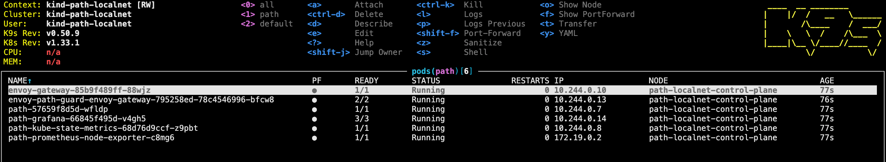

- [Overview](#overview)
  - [Why PATH Localnet?](#why-path-localnet)
- [Architecture](#architecture)
  - [Components](#components)
- [Prerequisites](#prerequisites)
- [Quick Start](#quick-start)
  - [1. Start PATH Localnet](#1-start-path-localnet)
  - [2. Verify the Setup](#2-verify-the-setup)
  - [2.1 Example Relays](#21-example-relays)
  - [3. Access Development Tools](#3-access-development-tools)
- [Make Targets](#make-targets)
  - [Core Commands](#core-commands)
  - [Debugging Commands](#debugging-commands)
- [Container Environment](#container-environment)
  - [Installed Tools](#installed-tools)
  - [File Mounts](#file-mounts)
  - [Configuration Validation](#configuration-validation)
- [Development Workflow](#development-workflow)
  - [Hot Reloading](#hot-reloading)
  - [Viewing Logs](#viewing-logs)


## Overview

The PATH Localnet is a containerized development environment that enables you to run the complete PATH, GUARD, and WATCH stack locally with minimal dependencies. It provides a fully isolated, reproducible development environment that requires only Docker on your host machine.

### Why PATH Localnet?

The PATH Localnet development container exists to:

- **Minimize Host Dependencies**: Only Docker is required on your machine - no need to install Tilt, Helm, Kind, kubectl, or other tools locally
- **Ensure Consistency**: All developers work with the same tool versions and configurations
- **Enable Full Stack Development**: Run PATH (API Gateway), GUARD (Envoy Gateway), and WATCH (Observability) together
- **Support Hot Reloading**: Make code changes and see them reflected immediately without rebuilding containers
- **Simplify Onboarding**: New developers can get started in minutes with a single command

## Architecture

The PATH Localnet runs as a Docker container that internally manages a complete Kubernetes environment:

```
┌─────────────────────────────────────────────────────────────┐
│                    Host Machine (Your Computer)             │
│                                                             │
│  ┌─────────────────────────────────────────────────────┐    │
│  │           Docker Desktop / Docker Engine            │    │
│  └─────────────────────────────────────────────────────┘    │
│                            │                                │
│  ┌─────────────────────────────────────────────────────┐    │
│  │         path-localnet Container (Docker-in-Docker)  │    │
│  │                                                     │    │
│  │  ┌────────────────────────────────────────────┐     │    │
│  │  │              Kind Kubernetes Cluster       │     │    │
│  │  │                                            │     │    │
│  │  │  ┌──────────┐  ┌──────────┐  ┌──────────┐  │     │    │
│  │  │  │   PATH   │  │  GUARD   │  │  WATCH   │  │     │    │
│  │  │  │   Pod    │  │  (Envoy) │  │ (Grafana)│  │     │    │
│  │  │  └──────────┘  └──────────┘  └──────────┘  │     │    │
│  │  └────────────────────────────────────────────┘     │    │
│  │                                                     │    │
│  │  ┌────────────────────────────────────────────┐     │    │
│  │  │              Tilt (Orchestrator)           │     │    │
│  │  └────────────────────────────────────────────┘     │    │
│  └─────────────────────────────────────────────────────┘    │
│                                                             │
│  Exposed Ports:                                             │
│  • 3070  → PATH API Gateway                                 │
│  • 10350 → Tilt UI                                          │
│  • 3003  → Grafana Dashboard                                │
└─────────────────────────────────────────────────────────────┘
```

### Components

- **PATH**: The API Gateway that handles relay requests
- **GUARD**: Envoy Gateway providing authentication, routing, and defense
- **WATCH**: Observability stack with Grafana, Prometheus, and metrics collection
- **Tilt**: Development orchestrator that manages hot reloading and service lifecycle
- **Kind**: Kubernetes-in-Docker providing the cluster environment

## Prerequisites

Before starting, ensure you have:

1. **Docker installed and running**:
   ```bash
   docker --version  # Should output Docker version
   docker ps         # Should list running containers (or be empty)
   ```

   :::tip
   If you do not have Docker installed, you can install it by running the following command:
   ```bash
   make install_tools
   ```
   :::

1. **Required configuration files**:
   - `./local/path/.config.yaml` - PATH gateway configuration
   - `./local/path/.values.yaml` - Helm values override file

   :::tip
   Grove employees can find valid configuration files on 1Password in the note called "PATH Localnet Config".
   
   For external contributors, you can generate starter configs:
   ```bash
   make config_shannon_populate    # Generate .config.yaml
   make configs_copy_values_yaml   # Copy default .values.yaml
   ```
   :::

## Quick Start

### 1. Start PATH Localnet

```bash
# Start with remote Helm charts (recommended for most users)
make path_up

# Or start with local Helm charts (for Helm chart development)
make path_up_local_helm
```

The startup process will:
1. Validate your configuration files against the schema
2. Create a Kind Kubernetes cluster
3. Deploy PATH, GUARD, and WATCH using Helm
4. Start Tilt for orchestration and hot reloading

:::info
First-time startup may take 3-5 minutes as Docker pulls the required images.
:::

### 2. Verify the Setup

Once started, you'll see:
```
🌿 PATH Localnet started successfully.
  🚀 Send relay requests to: http://localhost:3070/v1

🛠️  Development tools:
  🔧 Open container shell: make localnet_exec
  🔍 Launch k9s for debugging: make localnet_k9s
```

Test with a simple request:
```bash
curl http://localhost:3070/healthz
```

### 2.1 Example Relays

For more example relay requests, see [Example Relays](3_example_requests.md).

### 3. Access Development Tools

- **Tilt UI**: http://localhost:10350 - Monitor services, view logs, trigger rebuilds
- **Grafana**: http://localhost:3003 - View metrics and dashboards
- **PATH API**: http://localhost:3070 - Send relay requests


## Make Targets

The PATH Localnet provides several make targets for managing your development environment:

### Core Commands

- #### `make path_up`
   Starts the PATH Localnet environment using remote Helm charts from the official repository.

   ```bash
   make path_up
   ```

   This is the recommended way to start for most development tasks. The container will:
   - Pull the latest `ghcr.io/buildwithgrove/path-localnet-env` image
   - Mount your local PATH repository for hot reloading
   - Use Helm charts from https://buildwithgrove.github.io/helm-charts/

- #### `make path_up_local_helm`
   Starts the PATH Localnet with local Helm charts, useful when developing Helm chart changes.

   ```bash
   make path_up_local_helm
   ```

   You'll be prompted for the path to your local `helm-charts` repository. The default is `../helm-charts`.

   - #### `make path_down`
   Stops and removes the PATH Localnet container.

   ```bash
   make path_down
   ```

   This cleanly shuts down all services by stopping the localnet Docker container.

### Debugging Commands

- #### `make localnet_k9s`
   Launches [k9s](https://k9scli.io/), a terminal-based Kubernetes UI, inside the container.

   ```bash
   make localnet_k9s
   ```

   k9s provides an interactive way to:
   - Navigate Kubernetes resources
   - View and follow logs
   - Execute into pods
   - Edit resources
   - Monitor resource usage

   
   *k9s running inside the PATH localnet Docker container*

   :::tip k9s Quick Commands

   - `:pods` - List all pods
   - `:svc` - List all services  
   - `l` - View logs for selected resource
   - `d` - Describe selected resource
   - `s` - Shell into selected pod
   - `ctrl+a` - Show all namespaces
   - `?` - Show help menu
   - 
   :::

- #### `make localnet_exec`
   Opens an interactive shell inside the running PATH Localnet container.

   ```bash
   make localnet_exec
   ```

   Useful for:
   - Running kubectl commands directly
   - Inspecting logs and configurations
   - Debugging networking issues
   - Managing the Kind cluster

   Example session:
   ```bash
   $ make localnet_exec
   root@path-localnet:/app# kubectl get pods
   NAME                           READY   STATUS    RESTARTS   AGE
   path-5f7b9c4d6f-abc12         1/1     Running   0          5m
   envoy-gateway-xyz789          1/1     Running   0          5m
   grafana-6d8f9c7b5-def45      1/1     Running   0          5m

   root@path-localnet:/app# kubectl logs path-5f7b9c4d6f-abc12
   ```

## Container Environment

The PATH Localnet image includes all necessary development tools, meaning you can run PATH, GUARD, and WATCH locally without any additional dependencies.

- Image: `ghcr.io/buildwithgrove/path-localnet-env`
- [GHCR Repository](https://github.com/orgs/buildwithgrove/packages/container/package/path-localnet-env)


### Installed Tools

- **Go**: For building PATH
- **Tilt**: Development orchestrator
- **kubectl**: Kubernetes CLI
- **Kind**: Kubernetes in Docker
- **Helm 3**: Package manager for Kubernetes
- **k9s**: Terminal UI for Kubernetes
- **Docker**: Docker-in-Docker for Kind cluster
- **ajv-cli**: For validating configuration schema
- **yq/jq**: YAML/JSON processors

### File Mounts

The container mounts your local PATH repository at `/app`, enabling:
- Hot reloading of Go code changes
- Configuration file updates
- Access to test data and scripts

### Configuration Validation

On startup, the container validates your `./local/.config.yaml` against the [YAML schema](https://github.com/buildwithgrove/path/blob/main/config/config.schema.yaml) in the PATH repo.

## Development Workflow

### Hot Reloading

The PATH Localnet supports hot reloading for rapid development:

1. **Make code changes** in your local PATH repository
2. **Save the file** 
3. **Tilt detects changes** and triggers a rebuild
4. **New binary is deployed** to the Kind cluster
5. **Service restarts** with your changes

### Viewing Logs

Multiple ways to view logs:

1. Recommended: **Tilt UI** (http://localhost:10350):
   - Real-time log streaming
   - Filtered by service
   - Search functionality

2. **Inside the container**:
   ```bash
   make localnet_exec
   kubectl logs -f deployment/path
   ```

3. **Using k9s**:
   ```bash
   make localnet_k9s
   # Navigate to pod and press 'l'
   ```
