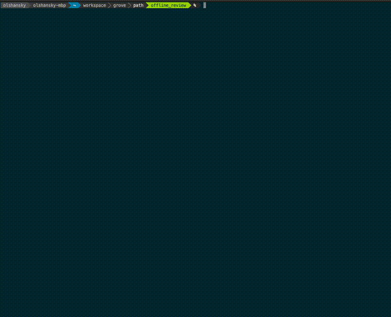

**Goal of this document**: Fully featured E2E & Load Tets to verify PATH works and scales.

<div align="center">

</div>

## Table of Contents <!-- omit in toc -->

- [tl;dr How do I run the tests?](#tldr-how-do-i-run-the-tests)
- [Overview](#overview)
- [E2E \& Load Test Modes](#e2e--load-test-modes)
  - [E2E Test Config Files](#e2e-test-config-files)
  - [Load Test Mode Configuration](#load-test-mode-configuration)
  - [Schema and Validation](#schema-and-validation)
  - [Supported Services in E2E Tests](#supported-services-in-e2e-tests)
  - [Environment Variables](#environment-variables)
  - [Extending/Updating/Adding EVM E2E Tests](#extendingupdatingadding-evm-e2e-tests)
  - [Test Metrics and Validation](#test-metrics-and-validation)
- [Troubleshooting](#troubleshooting)
  - [Running Binary manually (no docker)](#running-binary-manually-no-docker)
  - [Reviewing PATH Logs](#reviewing-path-logs)
  - [Debugging Anvil on Shannon Beta TestNet](#debugging-anvil-on-shannon-beta-testnet)

## tl;dr How do I run the tests?

**Run E2E tests with Docker containers:**

```bash
# Shannon E2E tests with default service IDs
make test_e2e_evm_shannon_defaults

# Shannon E2E tests with specified service IDs
make test_e2e_evm_shannon eth,anvil

# Morse E2E tests with default service IDs
make test_e2e_evm_morse

# Morse E2E tests with specified service IDs
make test_e2e_evm_morse F00C,F021
```

**Run load tests against existing gateways:**

```bash
# Shannon load tests with default service IDs
make test_load_evm_shannon_defaults

# Shannon load tests with specified service IDs
make test_load_evm_shannon eth,anvil

# Morse load tests with default service IDs
make test_load_evm_morse_defaults

# Morse load tests with specified service IDs
make test_load_evm_morse F00C,F021
```

## Overview

**The E2E tests verify:**

- Correct request routing
- Service responses (data + latency)
- System reliability under load
- Success metrics across different protocols (Morse & Shannon)

**We use the [Vegeta library](https://github.com/tsenart/vegeta) for HTTP load testing:**

- Can generate thousands of requests/sec
- Collects detailed metrics including latency percentiles (p50, p95, p99)
- Supports custom configurations and attack parameters
- Validates JSON-RPC responses and success rates

<div align="center">

</div>

## E2E & Load Test Modes

PATH E2E tests support two distinct modes of operation:

| Mode          | Make Targets                                                  | Purpose                                                                  | How it Works                                                                                                                                                                             | Use Cases                                                                          |
| ------------- | ------------------------------------------------------------- | ------------------------------------------------------------------------ | ---------------------------------------------------------------------------------------------------------------------------------------------------------------------------------------- | ---------------------------------------------------------------------------------- |
| **E2E Test**  | `make test_e2e_evm_morse` <br/> `make test_e2e_evm_shannon`   | Full end-to-end testing that starts PATH in an isolated Docker container | 1. Spins up PATH in a Docker container using Dockertest <br/> 2. Uses protocol config (`.morse.config.yaml` or `.shannon.config.yaml`) <br/> 3. Runs tests <br/> 4. Tears down container | - Full system validation <br/> - Continuous integration <br/> - Regression testing |
| **Load Test** | `make test_load_evm_morse` <br/> `make test_load_evm_shannon` | Performance testing against existing PATH instances                      | 1. Sends requests to a provided gateway URL (local or remote) <br/> 2. No Docker container setup required                                                                                | - Testing production gateway <br/> - Testing local PATH instances                  |

### E2E Test Config Files

**There are a few types of configs:**

- E2E Test mode requires protocol-specific configuration because it spins up a local PATH instance.
- Load Test mode targets an external or local PATH instance, so protocol configs are not needed.

| Configuration File                                 | E2E Test (Required?) | Load Test (Required?) |             Default available?              |
| -------------------------------------------------- | :------------------: | :-------------------: | :-----------------------------------------: |
| `./e2e/config/.e2e_load_test.config.yaml` (custom) |          ✅           |           ✅           | `e2e/config/e2e_load_test.config.tmpl.yaml` |
| `./e2e/config/.morse.config.yaml` (for Morse)      |          ✅           |           ❌           |                      ❌                      |
| `./e2e/config/.shannon.config.yaml` (for Shannon)  |          ✅           |           ❌           |                      ❌                      |

:::tip Populate PATH Configs

You can use the following commands to copy example configs and follow the instructions in your CLI:

- `make morse_prepare_e2e_config`
- `make shannon_prepare_e2e_config`
- `make copy_e2e_load_test_config`

<details>
<summary>🌿 For Grove Employees Only</summary>

Search for `E2E Config` in `1Password` and copy-paste those configs directly.

</details>

:::

### Load Test Mode Configuration

You will need one of the following:

1. **Portal Access**

   - `gateway_url_override`: `https://rpc.grove.city/v1`
   - Get credentials from the [Grove Portal](https://www.portal.grove.city)

2. **Local PATH Instance**

   - `gateway_url_override`: `http://localhost:3069/v1`
   - Run `make path_run` in another shell to start PATH

### Schema and Validation

The configuration uses a formal YAML schema with validation:

**Schema Location**: `./e2e/config/e2e_load_test.config.schema.yaml`

:::tip VSCode Validation

If you are using VSCode, we recommend using the [YAML Language Support](https://marketplace.visualstudio.com/items?itemName=redhat.vscode-yaml) extension for in-editor validation of the `.config.yaml` file.

Enable it by ensuring the following annotation is present at the top of your config file:

```yaml
# yaml-language-server: $schema=https://raw.githubusercontent.com/buildwithgrove/path/refs/heads/main/e2e/config/e2e_load_test.config.schema.yaml
```

:::

---

### Supported Services in E2E Tests

**All currently supported Grove Portal services are supported in the E2E & Load tests.**

:::tip

To see the list of supported services for the tests, see the `test_cases` array in the [E2E & Load Test Config](https://github.com/buildwithgrove/path/blob/main/e2e/config/e2e_load_test.config.tmpl.yaml) file.

:::

### Environment Variables

These environment variables are set by the test make targets, but if you wish to set them manually, see the table below:

<details>
<summary>Env Vars Table</summary>
| Variable         | Description                                                                                             | Values                              | Required |
| ---------------- | ------------------------------------------------------------------------------------------------------- | ----------------------------------- | -------- |
| TEST_MODE        | Determines the test execution mode                                                                      | `e2e`, `load`                       | Yes      |
| TEST_PROTOCOL    | Specifies which protocol to test                                                                        | `morse`, `shannon`                  | Yes      |
| TEST_SERVICE_IDS | Specifies which service IDs to test. If not set, the default service IDs for the protocol will be used. | Comma-separated list of service IDs | No       |
</details>

### Extending/Updating/Adding EVM E2E Tests

To add new services or methods to the E2E tests:

1. **Add new service definitions** to the `test_cases` array in your configuration file
2. **Configure service parameters** including contract addresses, start blocks, and transaction hashes for archival tests
3. **Set appropriate test parameters** like success thresholds, latency expectations, and request rates
4. **Add method overrides** if you need to test specific JSON-RPC methods for the new service
5. **Update the schema** in `e2e_load_test.config.schema.yaml` if you add new configuration fields

**Example new service configuration:**

```yaml
test_cases:
  - name: "New Chain Load Test"
    protocol: "morse"
    service_id: "FNEW"
    archival: true
    service_params:
      contract_address: "0x..."
      contract_start_block: 1000000
      transaction_hash: "0x..."
      call_data: "0x18160ddd"
    test_case_config_override:
      success_rate: 0.70 # Lower threshold for new networks
```

### Test Metrics and Validation

The E2E tests collect and validate comprehensive metrics across multiple dimensions:

| **Category**              | **Metrics Collected**                                                                                                                                        |
| ------------------------- | ------------------------------------------------------------------------------------------------------------------------------------------------------------ |
| **HTTP Metrics**          | - Success rates (HTTP 200) <br/> - Status code distribution <br/> - HTTP error categorization                                                                |
| **Latency Metrics**       | - P50, P95, P99 latency percentiles <br/> - Average latency <br/> - Per-method latency analysis                                                              |
| **JSON-RPC Validation**   | - Response unmarshaling success <br/> - JSON-RPC error field validation <br/> - Result field validation <br/> - Protocol-specific validation                 |
| **Service-Level Metrics** | - Per-service success aggregation <br/> - Cross-method performance comparison <br/> - Service reliability scoring <br/> - Error categorization and reporting |

:::important Threshold Validation

Tests will **fail** if any configured thresholds are exceeded, ensuring consistent service quality and performance.

:::

## Troubleshooting

### Running Binary manually (no docker)

Load tests may also be run against a local PATH instance.

**To enable this, first set `e2e_load_test_config.load_test_config.gateway_url_override` to `http://localhost:3069/v1` in the file `./e2e/config/.e2e_load_test.config.yaml`.**

**Then, in one shell, run:**

```bash
# Replace with .morse.config.yaml for Morse
cp ./e2e/config/.shannon.config.yaml ./local/path/.config.yaml
make path_run
```

**Once the PATH instance is running, in another shell, run one of the following:**

```bash
# Shannon load tests with default service IDs
make test_load_evm_shannon_defaults

# Shannon load tests with specified service IDs
make test_load_evm_shannon eth,anvil
```

### Reviewing PATH Logs

In E2E test mode, logs may be written to `./path_log_e2e_test_{timestamp}.txt`.

**In order to enable this, set the field `e2e_load_test_config.e2e_config.docker_config.log_to_file` to `true` in the file `./e2e/config/.e2e_load_test.config.yaml`.**

You should see the following log line at the bottom of the test summary:

```bash
===== 👀 LOGS 👀 =====

 ✍️ PATH container output logged to /tmp/path_log_e2e_test_1745527319.txt ✍️

===== 👀 LOGS 👀 =====

```

### Debugging Anvil on Shannon Beta TestNet

🌿 Grove Employees Only

Review the [Anvil Shannon Beta TestNet Debugging Playbook](https://www.notion.so/buildwithgrove/Playbook-Debugging-Anvil-E2E-on-Beta-TestNet-177a36edfff6809c9f24e865ec5adbf8?pvs=4) if you believe the Anvil Supplier is broken.
