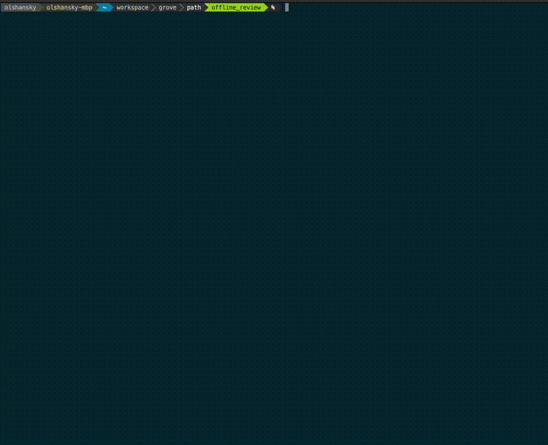

PATH E2E (End-to-End) tests check if the full system works as expected by simulating real user traffic.

<div align="center">

</div>

## Table of Contents <!-- omit in toc -->

- [Overview](#overview)
- [E2E Test Configuration](#e2e-test-configuration)
  - [Helpers to create configurations](#helpers-to-create-configurations)
- [Helper Make Targets](#helper-make-targets)
- [Troubleshooting](#troubleshooting)
  - [Running Binary manually (no docker)](#running-binary-manually-no-docker)
  - [Reviewing PATH Logs](#reviewing-path-logs)
  - [Debugging Anvil on Shannon Beta TestNet (:her)](#debugging-anvil-on-shannon-beta-testnet-her)
- [Configuration \& Implementation](#configuration--implementation)
  - [Supported Services](#supported-services)
  - [Environment Variables](#environment-variables)
  - [Extending/Updating/Adding EVM E2E Tests](#extendingupdatingadding-evm-e2e-tests)
  - [Test Metrics and Validation](#test-metrics-and-validation)

## Overview

**The E2E tests verify:**

- Correct request routing
- Service responses (data + latency)
- System reliability under load
- Success metrics

**We use the [Vegeta library](https://github.com/tsenart/vegeta) for HTTP load testing:**

- Generates thousands of requests/sec
- Collects detailed metrics
- Supports custom configs and attack configurations
- Measures latency (p50, p95, p99)

<div align="center">

</div>

## E2E Test Configuration

E2E tests need a valid config file in `./e2e`:

- `./e2e/morse.config.yaml` for Morse
- `./e2e/shannon.config.yaml` for Shannon

Config must match the protocol/services you want to test.

See [PATH Configuration File docs](./5_configurations_path.md) for details.

:::warning TODO: Prebuilt configs

TODO(@olshansk): Provide prebuilt configs for 1-minute onboarding.

:::

### Helpers to create configurations

You can use the following commands to copy example configs and follow the instructions in your CLI:

- `make morse_prepare_e2e_config`
- `make shannon_prepare_e2e_config`

<details>
<summary>🌿 For Grove Employees</summary>

Search for `E2E Config` in `1Password` and copy-paste those configs directly.

</details>

## Helper Make Targets

:::tip make help

Run `make help` to see all available make targets.

:::

**Only E2E tests for Shannon:**

```bash
make test_e2e_evm_shannon
```

**Only E2E tests for Morse:**

```bash
make test_e2e_evm_morse
```

**Saved Log Output to a File** (useful for debugging):

```bash
make test_e2e_evm_morse_with_logs
make test_e2e_evm_shannon_with_logs
```

**E2E for a specific service** (if you know which service ID you want to test):

```bash
make test_e2e_evm_morse SERVICE_ID_OVERRIDE=F021
```

**E2E against local PATH binary** (no Docker):

```bash
# Run make path_run in another shell
make test_e2e_evm_morse GATEWAY_URL_OVERRIDE=http://localhost:3069/v1
```

**Force Docker rebuild** (if you made changes to the code):

```bash
make test_e2e_evm_morse DOCKER_FORCE_REBUILD=true
```

**Wait 30s for hydrator checks** (if you're adding a new service):

```bash
make test_e2e_evm_morse WAIT_FOR_HYDRATOR=30
````

---

## Troubleshooting

### Running Binary manually (no docker)

**In one shell, run:**

```bash
# Replace with .morse.config.yaml for Morse
cp ./e2e/config/.shannon.config.yaml ./local/path/.config.yaml
make path_run
```

In another shell, run:

```bash
make test_e2e_evm_shannon GATEWAY_URL_OVERRIDE=http://localhost:3069/v1
```

### Reviewing PATH Logs

By default, the logs are written to `./path_log_e2e_test_{timestamp}.txt`.

You should see the following log line at the bottom of the test summary:

```bash
===== 👀 LOGS 👀 =====

 ✍️ PATH container output logged to /tmp/path_log_e2e_test_1745527319.txt ✍️

===== 👀 LOGS 👀 =====

```

### Debugging Anvil on Shannon Beta TestNet (:her)

🌿 Grove Employees Only

Review the [Anvil Shannon Beta TestNet Debugging Playbook](https://www.notion.so/buildwithgrove/Playbook-Debugging-Anvil-E2E-on-Beta-TestNet-177a36edfff6809c9f24e865ec5adbf8?pvs=4) if you believe the Anvil Supplier is broken.

---

## Configuration & Implementation

The source code for E2E tests is available [here](https://github.com/buildwithgrove/path/tree/main/e2e).

:::info

The sections below were last updated on 04/24/2025.

:::

### Supported Services

| Protocol | Service ID | Chain Name       | Type      |
| -------- | ---------- | ---------------- | --------- |
| Morse    | F00C       | Ethereum         | Archival  |
| Morse    | F021       | Polygon          | Archival  |
| Morse    | F01C       | Oasys            | Archival  |
| Morse    | F036       | XRPL EVM Testnet | Archival  |
| Shannon  | anvil      | Local Ethereum   | Ephemeral |

### Environment Variables

| Variable             | Description                                                                                           | Default                  | Required |
| -------------------- | ----------------------------------------------------------------------------------------------------- | ------------------------ | -------- |
| GATEWAY_URL_OVERRIDE | Custom PATH gateway URL (useful for local dev). If set, skips Docker and runs tests against this URL. | http://localhost:3069/v1 | No       |
| DOCKER_LOG           | Log Docker container output.                                                                          | false                    | No       |
| DOCKER_FORCE_REBUILD | Force Docker image rebuild (useful after code changes).                                               | false                    | No       |
| SERVICE_ID_OVERRIDE  | Test only a specific service ID.                                                                      | All services             | No       |
| WAIT_FOR_HYDRATOR    | Seconds to wait for hydrator checks.                                                                  | 0                        | No       |

### Extending/Updating/Adding EVM E2E Tests

To add new services or methods to the E2E tests:

1. Add new service definitions to the appropriate test case array in `evm_test.go`
2. If needed, add new method definitions in `evm_methods_test.go`
3. Configure appropriate success thresholds and latency expectations

### Test Metrics and Validation

The E2E tests collect and validate various metrics:

- HTTP success rates (percentage of successful requests)
- Response latency percentiles (p50, p95, p99)
- JSON-RPC response validation
- Error rates and types
