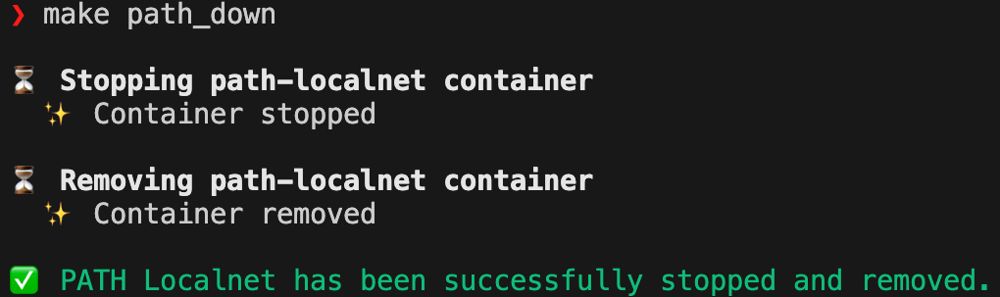
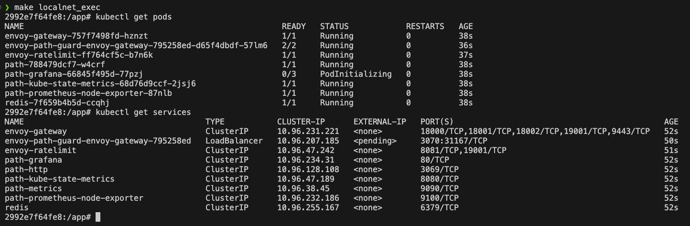

Technical details for developers who want to understand PATH's local development environment.

- [PATH Localnet Environment](#path-localnet-environment)
  - [Resources](#resources)
- [Running the PATH Localnet Environment](#running-the-path-localnet-environment)
  - [`path_up`](#path_up)
  - [`path_down`](#path_down)
- [Interacting with the PATH Localnet Environment](#interacting-with-the-path-localnet-environment)
- [Tools Included in the Localnet Docker Image](#tools-included-in-the-localnet-docker-image)
- [Updating the `path-localnet-env` Image on GitHub Container Registry](#updating-the-path-localnet-env-image-on-github-container-registry)
- [Architecture Overview](#architecture-overview)

## PATH Localnet Environment

**PATH**'s local development mode uses a specialized multi-architecture Docker image that contains all the required tools to run PATH and its Helm Charts.

**As a result, the only dependency for running PATH's local development environment is Docker.**


<div align="center">
  <a href="https://docs.docker.com/get-started/get-docker/" target="_blank">
    
    <p>Docker Installation Guide</p>
  </a>
</div>
<br/>


:::info

For a deep dive into the full PATH stack that is run inside the PATH Localnet Docker container, see the [PATH Helm Charts](../../operate/helm/1_introduction.md) section of the documentation.

:::

### Resources

- [PATH Localnet Env Docker Image](https://github.com/orgs/buildwithgrove/packages/container/package/path-localnet-env)
- [PATH Localnet Env Dockerfile](https://github.com/buildwithgrove/path/blob/main/local/Dockerfile.dev)

## Running the PATH Localnet Environment

### `path_up`

To run PATH Localnet in any development environment, ensure that the Docker daemon is running and then run the following Make target:

```bash
make path_up
```

This will pull the `path-localnet-env` Docker image and run it.

Your **terminal** should display the following:


Visit the **Tilt dashboard** at [localhost:10350](<http://localhost:10350/r/(all)/overview>) and make sure everything is 🟢.


### `path_down`

To stop PATH Localnet, run the following Make target:

```bash
make path_down
```

Your **terminal** should display the following:



:::tip

_Because all PATH Localnet resources are run inside the Docker container, there is no need to clean up the KIND cluster or any Kubernetes resources._

:::

## Interacting with the PATH Localnet Environment

To access the PATH Localnet environment, you can use the following Make target:

```bash
make localnet_exec
```

This will open a shell inside the PATH Localnet environment's Docker container.

You can then run any commands you need to interact with the PATH Localnet environment.

For example, you can interact with the PATH Localnet environment's Kubernetes cluster.




## Tools Included in the Localnet Docker Image

- [**Go**](https://go.dev/dl/): The Go programming language.
- [**Tilt**](https://docs.tilt.dev/install.html): Local Kubernetes development environment
- [**kubectl**](https://kubernetes.io/docs/tasks/tools/#kubectl): CLI for interacting with Kubernetes
- [**Kind**](https://kind.sigs.k8s.io/#installation-and-usage): Local Kubernetes cluster
- [**Helm**](https://helm.sh/docs/intro/install/): Package manager for Kubernetes

## Updating the `path-localnet-env` Image on GitHub Container Registry

:::tip 🌿 Grove Employees Only 🌿

In rare cases, we may need to update the `path-localnet-env` Docker image. _For example, if we need to update the Go version to match the version used in PATH._

To build and push a new version of the `path-localnet-env` Docker image, you can use the following Make target:

```bash
make build_and_push_localnet_image
```

This will build the multi-architecture Docker image from the [Dockerfile.dev](https://github.com/buildwithgrove/path/blob/main/local/Dockerfile.dev) file and push it to the [GitHub Container Registry](https://github.com/orgs/buildwithgrove/packages/container/package/path-localnet-env).

**⚠️ You must be logged in to the GitHub Container Registry to push the image. ⚠️**

:::

## Architecture Overview

_This section will be expanded as more technical details are moved from other documentation files._
