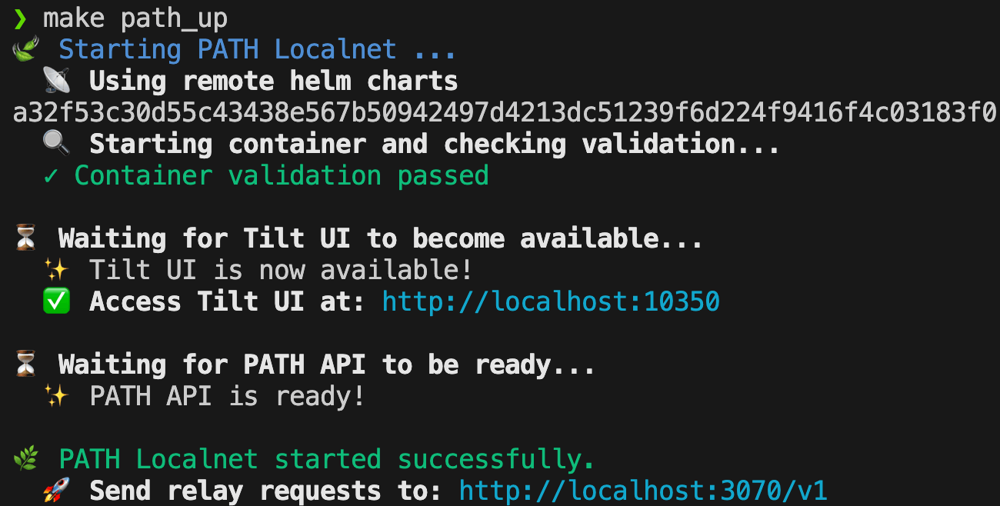

This guide covers setting up `PATH` with the **Morse** protocol. In MainNet as of 01/2025.

## Table of Contents <!-- omit in toc -->

- [0. Prerequisites](#0-prerequisites)
- [1. Setup Morse Protocol Accounts](#1-setup-morse-protocol-accounts)
  - [1.1 AAT Generation](#11-aat-generation)
- [2. Configure PATH](#2-configure-path)
  - [2.1 Generate Morse Config](#21-generate-morse-config)
  - [Update \& Verify the Configuration](#update--verify-the-configuration)
- [3. Start PATH](#3-start-path)
- [3.1 Start PATH](#31-start-path)
  - [3.1 Monitor PATH](#31-monitor-path)
- [4. Test Relays](#4-test-relays)
- [What's Next?](#whats-next)
- [Additional Notes](#additional-notes)

## 0. Prerequisites

1. Prepare your environment by following the instructions in the [**environment setup**](./environment.md) guide.
2. Install the [**Pocket CLI**](https://github.com/pokt-network/homebrew-pocket-core): CLI for interacting with Pocket's Morse Network

## 1. Setup Morse Protocol Accounts

:::caution

This is a manual and poorly documented process in Morse.

:::

`Application Authentication Tokens` (**AATs**) are auth tokens that allow application
clients to access the network without the need to expose their private keys.
Once you have one or more valid AATs, you can populate the configuration files required to run the full `PATH Gateway` instance.

The following resources are also good references and starting points:

- [What are AATs?](https://docs.pokt.network/gateways/host-a-gateway/relay-process#what-are-aats)
- [Host a Gateway on Morse](https://docs.pokt.network/gateways/host-a-gateway)
- [pocket-core/doc/specs/application-auth-token.md](https://github.com/pokt-network/pocket-core/blob/7f936ff7353249b161854e24435e4bc32d47aa3f/doc/specs/application-auth-token.md)
- [pocket-core/doc/specs/cli/apps.md](https://github.com/pokt-network/pocket-core/blob/7f936ff7353249b161854e24435e4bc32d47aa3f/doc/specs/cli/apps.md)
- [Gateway Server Kit instructions (as a reference)](https://github.com/pokt-network/gateway-server/blob/main/docs/quick-onboarding-guide.md#5-insert-app-stake-private-keys)

_If you are unsure of where to start, you should reach out to the team directly._

### 1.1 AAT Generation

We strongly recommend following the resources above.

However, assuming you have access to a **staked application**, you can follow the instructions below.

<details>

<summary>tl;dr Use at your own risk copy-pasta commands</summary>

**Get the source code:**

```bash
git clone git@github.com:pokt-network/pocket-core.git
cd pocket-core
```

**Build your own `pocket-core` binary:**

```bash
go build -o pocket ./app/cmd/pocket_core/main.go
```

**Generate an AAT:**

```bash
./pocket-core create-aat <ADDR_APP> <CLIENT_PUB>
```

**Take note of the output:**

```json
{
  "version": "0.0.1",
  "app_pub_key": <APP_PUB>,
  "client_pub_key": <CLIENT_PUB>,
  "signature": <APP_SIG>
}
```

**So you can prepare a configuration like so:**

```yaml
morse_config:
  # ...
  relay_signing_key: "CLIENT_PRIV"
  # ...
signed_aats:
  <ADDR_APP>:
    client_public_key: "<CLIENT_PUB>"
    application_public_key: "<APP_PUB>"
    application_signature: "<APP_SIG>"
```

</details>

## 2. Configure PATH

### 2.1 Generate Morse Config

Run the following commands to generate a Morse config at `local/path/config/.config.yaml`:

```bash
make prepare_morse_e2e_config # Generate ./e2e/.morse.config.yaml
make copy_morse_e2e_config_to_local # Copy to ./local/path/.config.yaml
# Manually update ./local/path/.config.yaml
```

### Update & Verify the Configuration

You'll need to manually update these fields in the config file:

- `url`
- `relay_signing_key`
- `signed_aats`

And then check the updated config:

```bash
cat local/path/config/.config.yaml
```

## 3. Start PATH

Make sure to have followed the entire [**environment setup**](./environment.md) guide before proceeding.

## 3.1 Start PATH

Run the entire PATH stack in Tilt by running:

```bash
make path_up
```

You can stop the PATH stack by running:

```bash
make path_down
```

### 3.1 Monitor PATH



Once you see the above log, you may visit [localhost:10350](<http://localhost:10350/r/(all)/overview>) to view the Tilt dashboard.


_PATH Running in Tilt_

## 4. Test Relays

:::tip

The makefile helpers in `makefiles/test_requests.mk` can make iterating on these requests easier.

:::

Send a test relay (`make test_request__service_id_header_morse`):

```bash
curl http://localhost:3070/v1 \
  -H "Target-Service-Id: polygon" \
  -H "Authorization: test_api_key" \
  -d '{"jsonrpc": "2.0", "id": 1, "method": "eth_blockNumber" }'
```

:::warning Retries

If a requests fail, retry a few times as you may hit unresponsive nodes

:::


## What's Next?

Now that you have PATH running, take a look at the [Configuration](./configuration.md) guide to learn more about the different configuration options available.

## Additional Notes

- The Morse protocol setup process is more manual than Shannon
- Pay close attention to field names in configuration files
- Keep your configuration secure as it contains sensitive information
- For troubleshooting, consult the [Gateway Server Kit instructions](https://github.com/pokt-network/gateway-server/blob/main/docs/quick-onboarding-guide.md#5-insert-app-stake-private-keys)
