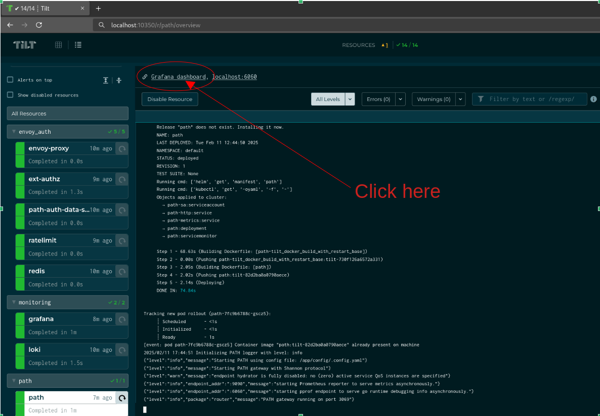
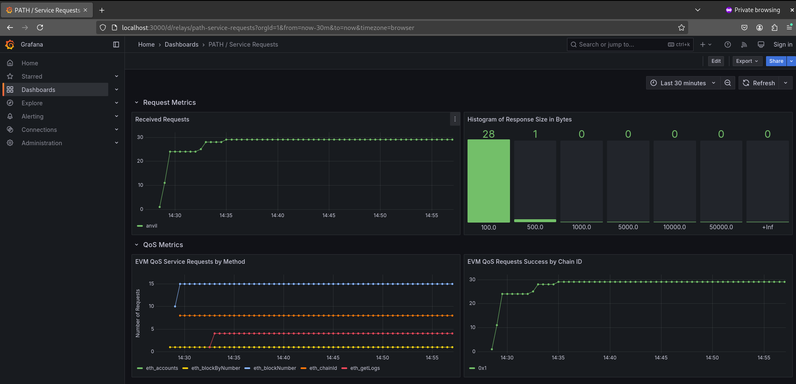

## Introduction <!-- omit in toc -->

This walkthrough assumes you have gone through [Local PATH Walkthrough](./walkthrough.md)
and have PATH running in Tilt Mode.

- [1. Accessing PATH Metrics](#1-accessing-path-metrics)
- [2. Grafana Dashboards Definitions](#2-grafana-dashboards-definitions)

## 1. Accessing PATH Metrics

In Tilt Mode, PATH metrics can be accessed from [PATH Tilt UI](http://localhost:10350/r/path/overview) by clicking
in the top left corner to view [PATH Grafana Service Requests Dashboard](http://localhost:3000/d/relays/path-service-requests?orgId=1).

## 2. Grafana Dashboards Definitions

The predefined Grafana dashboard definitions live under [Grafana dashboards directory](https://github.com/buildwithgrove/path/tree/main/local/grafana-dashboards).

<!---
TODO_MVP(@adshmh): add a section to reference the metrics package once PR #152 is merged.
-->
