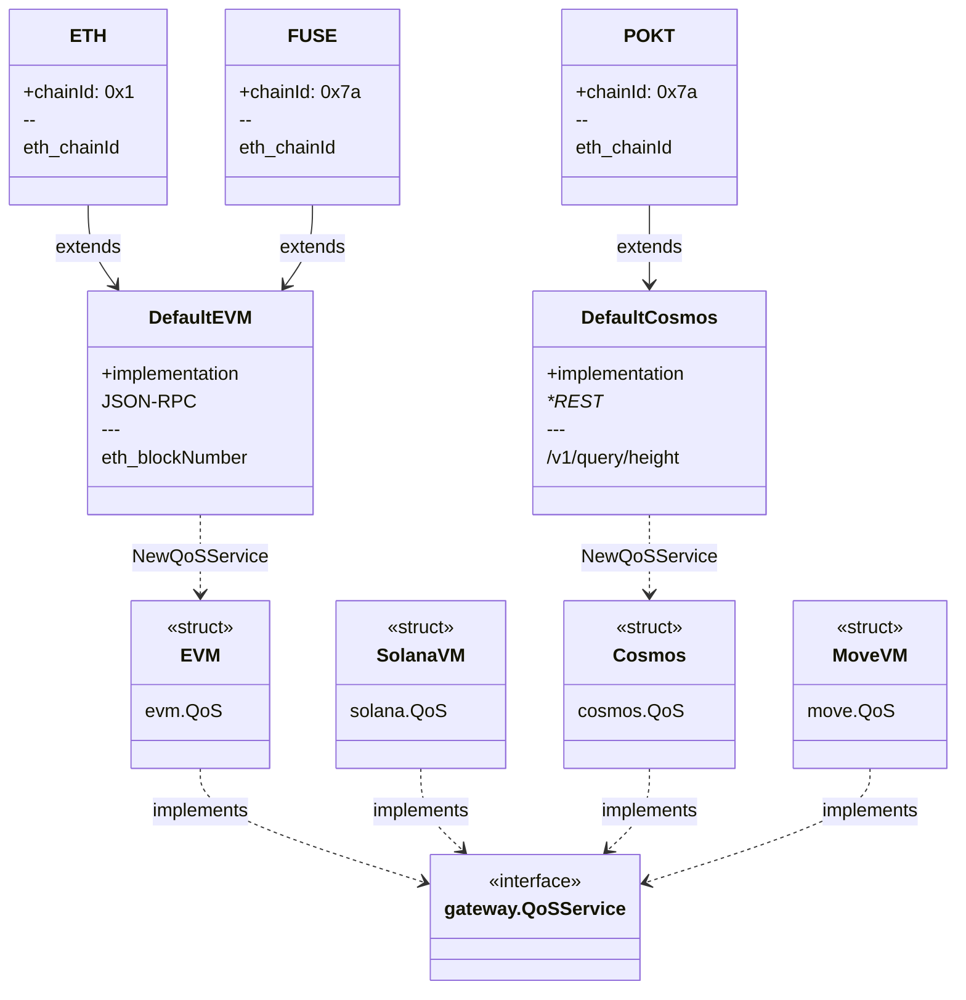

## Table of Contents <!-- omit in toc -->

- [Quality of Service Structure](#quality-of-service-structure)

## Quality of Service Structure

The diagram below shows the intended high level structure of the QoS system in PATH.

:::note

The QoS package is under active development and does not currently reflect the final design as described in the diagram below.

:::

