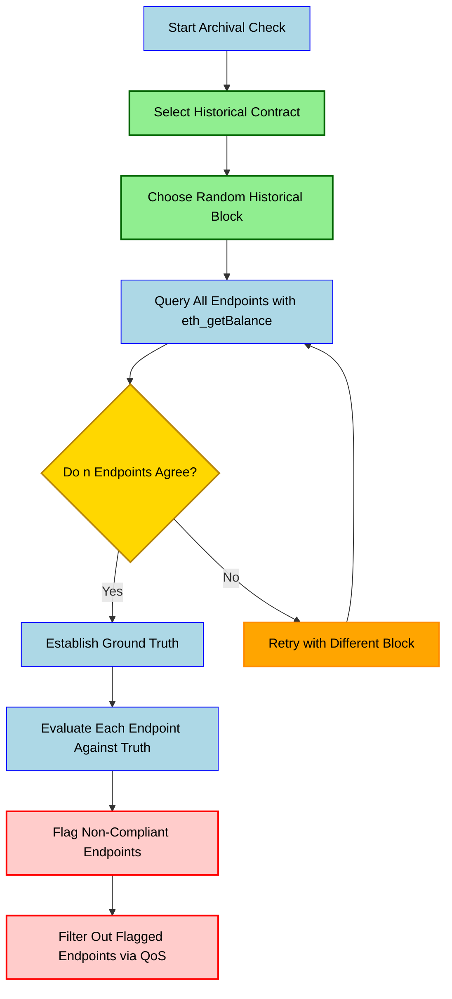

## EVM Archival Checks <!-- omit in toc -->

## Table of Contents <!-- omit in toc -->

- [Overview](#overview)
- [How It Works](#how-it-works)
- [Process Flow](#process-flow)
- [Understanding Archive Data](#understanding-archive-data)
- [Node Types and Archive Data](#node-types-and-archive-data)
  - [Full Nodes](#full-nodes)
  - [Archive Nodes](#archive-nodes)
- [RPC Methods Requiring Archive Data](#rpc-methods-requiring-archive-data)
- [References](#references)

## Overview

Archival checks verify that nodes can provide accurate historical blockchain data beyond the recent blocks.
This is crucial for applications requiring historical state information and ensures that node providers maintain complete blockchain history.

:::tip HOW TO ADD ARCHIVAL CHECKS

For information on how to add new EVM archival checks configurations, see the [How to Add Archival Configs](./3_adding_new_archival.md) page.

:::

## How It Works

The EVM archival validation process in PATH follows these steps as of #194:

1. **Contract Selection**: The system configures specific blockchain contracts that have been widely used since early in the chain's history
2. **Block Selection**: A random historical block is selected from the past (between contract deployment and what's considered "recent")
   - For EVM chains, "recent" is defined as `128 blocks` below the latest block height per industry wide standards
3. **Data Querying**: PATH queries all endpoints in the session for the contract's balance using `eth_getBalance` at this historical block
4. **Consensus Establishment**: When `n` endpoints (currently hardcoded to `5`) independently report the same balance value, this becomes our `ground truth`
5. **Validation**: Each endpoint is evaluated against this established truth
   - Endpoints reporting different balance values are flagged as lacking proper archival data
   - These non-compliant endpoints are filtered out by Quality of Service (QoS)

## Process Flow

## Understanding Archive Data

Archive data refers to blockchain data older than `128` blocks (approximately `25.6` minutes old on Ethereum).

This threshold is significant because:

- 128 blocks represent approximately 4 epochs on Ethereum
- With blocks created every ~12 seconds, this equals about 25.6 minutes
- Data older than 4 epochs is considered "finalized" in terms of commitment level

## Node Types and Archive Data

### Full Nodes

- Store current and recent blockchain states (up to the last 128 blocks)
- Participate in validating newly added blocks
- Can process transactions, execute smart contracts, and query/serve recent blockchain data
- Can access some historical data via tracing but inefficient for this purpose

### Archive Nodes

- Store the same information as full nodes plus all previous states of the blockchain
- Require significant hardware investment, higher running costs, and technical expertise
- Build archival blockchain data quickly and efficiently
- Essential for querying arbitrary historical data, such as user balances at specific historical blocks

## RPC Methods Requiring Archive Data

The following methods require archive data when requesting information older than 128 blocks:

- `eth_getBalance`
- `eth_call`
- `eth_getCode`
- `eth_getStorageAt`

Note: These methods can also be used for recent data (< 128 blocks old), but archive access is required when requesting older data.

## References

- [Chainstack: EVM Nodes - A Dive into the Full vs Archive Mode](https://chainstack.com/evm-nodes-a-dive-into-the-full-vs-archive-mode/)
- [Alchemy: What is Archive Data on Ethereum](https://docs.alchemy.com/docs/what-is-archive-data-on-ethereum)
- [QuickNode: Ethereum Full Node vs Archive Node](https://www.quicknode.com/guides/infrastructure/node-setup/ethereum-full-node-vs-archive-node)
