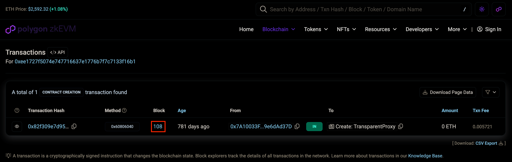

## EVM Archival Checks <!-- omit in toc -->

## Table of Contents <!-- omit in toc -->

- [Overview](#overview)
- [How It Works](#how-it-works)
- [Process Flow](#process-flow)
- [Understanding Archive Data](#understanding-archive-data)
- [Node Types and Archive Data](#node-types-and-archive-data)
  - [Full Nodes](#full-nodes)
  - [Archive Nodes](#archive-nodes)
- [RPC Methods Requiring Archive Data](#rpc-methods-requiring-archive-data)
- [Adding new EVM Archival Checks](#adding-new-evm-archival-checks)
- [References](#references)

## Overview

Archival checks verify that nodes can provide accurate historical blockchain data beyond the recent blocks.
This is crucial for applications requiring historical state information and ensures that node providers maintain complete blockchain history.

## How It Works

The EVM archival validation process in PATH follows these steps as of #194:

1. **Contract Selection**: The system configures specific blockchain contracts that have been widely used since early in the chain's history
2. **Block Selection**: A random historical block is selected from the past (between contract deployment and what's considered "recent")
   - For EVM chains, "recent" is defined as `128 blocks` below the latest block height per industry wide standards
3. **Data Querying**: PATH queries all endpoints in the session for the contract's balance using `eth_getBalance` at this historical block
4. **Consensus Establishment**: When `n` endpoints (currently hardcoded to `5`) independently report the same balance value, this becomes our `ground truth`
5. **Validation**: Each endpoint is evaluated against this established truth
   - Endpoints reporting different balance values are flagged as lacking proper archival data
   - These non-compliant endpoints are filtered out by Quality of Service (QoS)

## Process Flow


## Understanding Archive Data

Archive data refers to blockchain data older than `128` blocks (approximately `25.6` minutes old on Ethereum).

This threshold is significant because:

- 128 blocks represent approximately 4 epochs on Ethereum
- With blocks created every ~12 seconds, this equals about 25.6 minutes
- Data older than 4 epochs is considered "finalized" in terms of commitment level

## Node Types and Archive Data

### Full Nodes

- Store current and recent blockchain states (up to the last 128 blocks)
- Participate in validating newly added blocks
- Can process transactions, execute smart contracts, and query/serve recent blockchain data
- Can access some historical data via tracing but inefficient for this purpose

### Archive Nodes

- Store the same information as full nodes plus all previous states of the blockchain
- Require significant hardware investment, higher running costs, and technical expertise
- Build archival blockchain data quickly and efficiently
- Essential for querying arbitrary historical data, such as user balances at specific historical blocks

## RPC Methods Requiring Archive Data

The following methods require archive data when requesting information older than 128 blocks:

- `eth_getBalance`
- `eth_call`
- `eth_getCode`
- `eth_getStorageAt`

Note: These methods can also be used for recent data (< 128 blocks old), but archive access is required when requesting older data.

## Adding new EVM Archival Checks

The process for adding new archival check configurations is somewhat manual but most be performed only once per chain.

Configuration must be added to [`service_qos_config.go`](https://github.com/buildwithgrove/path/blob/main/config/service_qos_config.go).

For more information on the `service_qos_config.go` file, see the [Service QoS Config](./1_supported_services.md) page.

**Example**

This example uses the `Polygon zkEVM` chain (`F029`). Most EVM chain block explorers use a similar format for their browser UI.

- Block Explorer: https://zkevm.polygonscan.com/

**Steps**

1. Go to chain's block explorer and search for `Top Account` in the `Blockchain` dropdown

   <div align="center">
   
   </div>

2. Find an account with lots of activity and click on the `Address`

   <div align="center">
   
   </div>

3. Under the `Filters` section, select `View Contract Creation`

   <div align="center">
   
   </div>

4. Take note of the block number of the first transaction for that address

   <div align="center">
   
   </div>

5. In the [`service_qos_config.go`](https://github.com/buildwithgrove/path/blob/main/config/service_qos_config.go) file, add a new entry to the `shannonServices` and/or `morseServices` array

   :::important IMPORTANT

   The configuration must be entered in this exact format.

   ```go
   // Polygon zkEVM
   evm.NewEVMServiceQoSConfig("F029", "0x44d", evm.NewEVMArchivalCheckConfig(
      // https://zkevm.polygonscan.com/address/0xee1727f5074e747716637e1776b7f7c7133f16b1
      "0xee1727f5074E747716637e1776B7F7C7133f16b1",
      // Contract start block
      111,
   )),
   ```

   It must contain the following elements in `evm.NewEVMArchivalCheckConfig`, exactly as shown above.

   - Line 1: The URL for the contract address on the block explorer as a comment
      - _Example: `// https://zkevm.polygonscan.com/address/0xee1727f5074e747716637e1776b7f7c7133f16b1`_
   - Line 2: The contract address as the first parameter
      - _Example: `"0xee1727f5074E747716637e1776B7F7C7133f16b1"`_
   - Line 3: A comment containing `// Contract start block`
   - Line 4: A block number just slightly higher than the first transaction for that address as the second parameter
      - _Example: `111`_

   :::

6. Configure PATH for the service you want to test, run `make path_run` for that service and validate that data is returned correctly for the requested block.

   :::tip 

   Use an `eth_getBalance` request for:

   - The contract address
     - _Example: `0xee1727f5074E747716637e1776B7F7C7133f16b1`_
   - An old block hash, ideally close to the first transaction for that address
     - _Example: `0x15E` (350)_

   ```bash
   curl http://localhost:3069/v1 \
     -H "Target-Service-Id: F029" \
     -d '{
        "jsonrpc": "2.0",
        "method": "eth_getBalance",
        "id": 1,
        "params": [
           "0xee1727f5074E747716637e1776B7F7C7133f16b1",
           "0x15E"
        ]
     }'
   ```

   Response:

   ```json
   {
      "id": 1,
      "jsonrpc": "2.0",
      "result": "0x247a76d7647c0000"
   }
   ```

   :::

## References

- [Chainstack: EVM Nodes - A Dive into the Full vs Archive Mode](https://chainstack.com/evm-nodes-a-dive-into-the-full-vs-archive-mode/)
- [Alchemy: What is Archive Data on Ethereum](https://docs.alchemy.com/docs/what-is-archive-data-on-ethereum)
- [QuickNode: Ethereum Full Node vs Archive Node](https://www.quicknode.com/guides/infrastructure/node-setup/ethereum-full-node-vs-archive-node)
