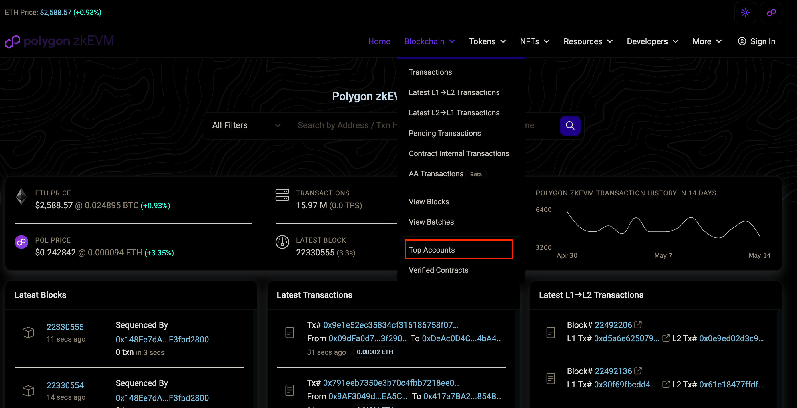
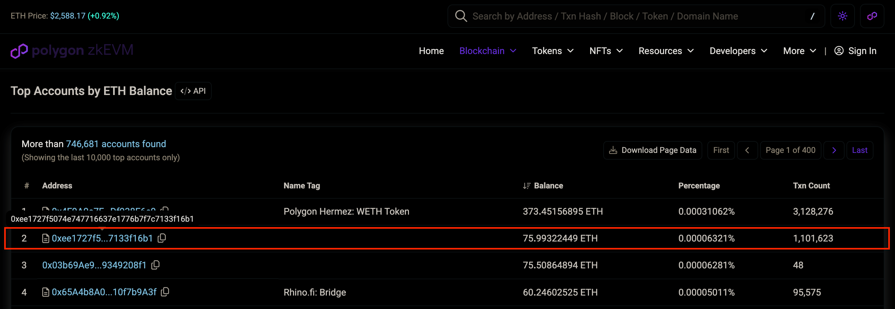
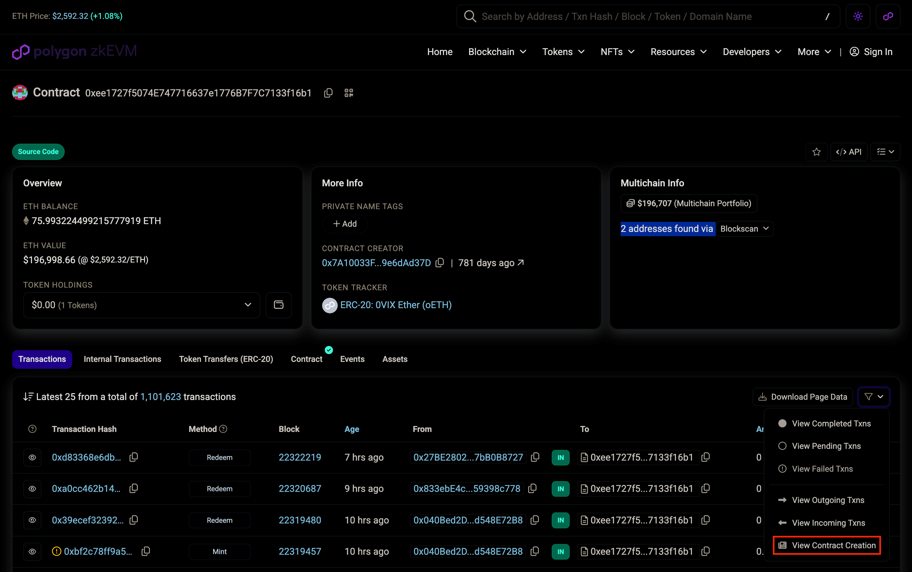
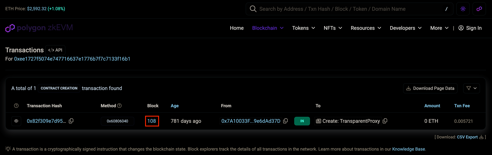

**🧑‍🎓 Instructions for adding new archival check configurations by following an example for `Polygon zkEVM` 🧑‍🎓**

## Table of Contents <!-- omit in toc -->

- [Overview](#overview)
  - [Service QoS Configurations](#service-qos-configurations)
- [Adding an Archival Check By Example: `Polygon zkEVM`](#adding-an-archival-check-by-example-polygon-zkevm)
- [0. Find a Block Explorer](#0-find-a-block-explorer)
  - [1. Go to the chain's block explorer](#1-go-to-the-chains-block-explorer)
  - [2. Choose a top account](#2-choose-a-top-account)
  - [3. Find the contract creation block](#3-find-the-contract-creation-block)
  - [4. Add the new archival check configuration](#4-add-the-new-archival-check-configuration)
  - [5. Send a test request](#5-send-a-test-request)
- [Additional Resources](#additional-resources)

## Overview

<!-- TODO_MOVE(@commoddity,): Update this section and merge it into JUDGE docs once JUDGE PR is merged -->

The process of configuring archival checks for a new chain is manual but only needs to be performed once per chain.

### Service QoS Configurations

QoS configurations are stored in [`path/config/service_qos_config.go`](https://github.com/buildwithgrove/path/blob/main/config/service_qos_config.go).

## Adding an Archival Check By Example: `Polygon zkEVM`

This example uses the `Polygon zkEVM` chain (`F029`).

## 0. Find a Block Explorer

Firstly, find a publically accessible block explorer for the chain. Most EVM chain block explorers use a similar format for their browser UI.

Block Explorer for `Polygon zkEVM`: [zkevm.polygonscan.com/](https://zkevm.polygonscan.com/)

### 1. Go to the chain's block explorer

Go to the chain's block explorer and search for `Top Account` in the `Blockchain` dropdown.

   <div align="center">
   
   </div>

### 2. Choose a top account

Find an account with lots of activity and click on the `Address`.

   <div align="center">
   
   </div>

### 3. Find the contract creation block

Under the `Filters` section, select `View Contract Creation`.

   <div align="center">
   
   </div>

Take note of the block number of the first transaction for that address.

   <div align="center">
   
   </div>

### 4. Add the new archival check configuration

In the [`path/config/service_qos_config.go`](https://github.com/buildwithgrove/path/blob/main/config/service_qos_config.go) file, add a new entry to the `shannonServices` array.

**The configuration MUST be entered in this exact format**:

```go
// Polygon zkEVM
evm.NewEVMServiceQoSConfig("F029", "0x44d", evm.NewEVMArchivalCheckConfig(
   // https://zkevm.polygonscan.com/address/0xee1727f5074e747716637e1776b7f7c7133f16b1
   "0xee1727f5074E747716637e1776B7F7C7133f16b1",
   // Contract start block
   111,
)),
```

It must contain the following elements in `evm.NewEVMArchivalCheckConfig`, exactly as shown above.

| Line | Description                                                                                             | Example                                                                                      |
| ---- | ------------------------------------------------------------------------------------------------------- | -------------------------------------------------------------------------------------------- |
| 1    | A comment containing the URL for the contract address on the block explorer as a comment                | `// https://zkevm.polygonscan.com/address/`<br/>`0xee1727f5074e747716637e1776b7f7c7133f16b1` |
| 2    | The contract address as the first parameter                                                             | `"0xee1727f5074E747716637e1776B7F7C7133f16b1"`                                               |
| 3    | A comment containing `// Contract start block`                                                          | `// Contract start block`                                                                    |
| 4    | A block number just slightly higher than the first transaction for that address as the second parameter | `111`                                                                                        |

### 5. Send a test request

Configure PATH for the service you want to test, and run `make path_run` to start PATH from a local binary.

:::tip Pocket Network Cheat Sheet

For information on how to configure PATH for a service, see the [Shannon Cheat Sheet](../../develop/path/2_cheatsheet_shannon.md).

:::

Then send a request to validate that data is returned correctly for the requested block.

:::info Example `eth_getBalance` Request

- The example contract address: `0xee1727f5074E747716637e1776B7F7C7133f16b1`
- A randomly selected block hash (ideally close to the first transaction for that address): `0x15E` (350)

**Request**:

```bash
curl http://localhost:3069/v1 \
  -H "Target-Service-Id: F029" \
  -d '{
     "jsonrpc": "2.0",
     "method": "eth_getBalance",
     "id": 1,
     "params": [
        "0xee1727f5074E747716637e1776B7F7C7133f16b1",
        "0x15E"
     ]
  }'
```

**Expect Response**:

```json
{
  "id": 1,
  "jsonrpc": "2.0",
  "result": "0x247a76d7647c0000"
}
```

:::

## Additional Resources

- [All Service QoS Configurations](./1_supported_services.md)
- [How EVM Archival Checks Work](./2_evm_archival.md)
