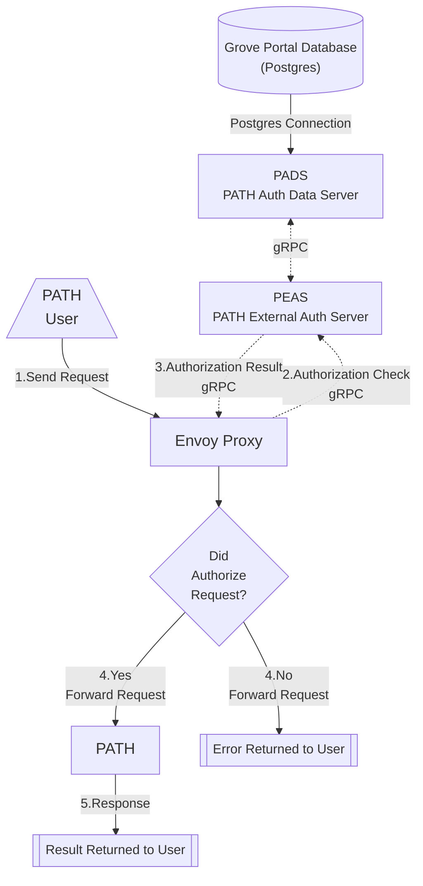

import RemoteMarkdown from '@site/src/components/RemoteMarkdown';

:::warning 🌿 GROVE ONLY

This section is only relevant to Grove's Portal authentication implementation.

If you are not using Grove's Portal authentication, you will likely not find anything of value here.

But feel free to take a look if you're curious.

:::

## Table of Contents <!-- omit in toc -->

- [Overview](#overview)
  - [Architecture Diagram](#architecture-diagram)
  - [Enabling Grove Auth](#enabling-grove-auth)
  - [Documentation References](#documentation-references)
- [PADS Documentation](#pads-documentation)
  - [Repo](#repo)
  - [Grove Portal Database](#grove-portal-database)
  - [README.md](#readmemd)
- [PEAS Documentation](#peas-documentation)
  - [Repo](#repo-1)
  - [README.md](#readmemd-1)


## Overview

GUARD contains configurations to implement authentication for PATH in a way that is compatible with Grove's Portal.

This Grove specific implementation is comprised of two components:

- `PEAS` - PATH External Auth Server
  - This is a gRPC server that is responsible for checking if a request is authorized to access a specific service.
  - Implement's Envoy Proxy's `ext_authz` gRPC interface.
    - [Envoy External Authorization HTTP Filter Docs](https://www.envoyproxy.io/docs/envoy/latest/configuration/http/http_filters/ext_authz_filter)
- `PADS` - PATH Auth Data Server
  - This is a gRPC server that is responsible for providing the auth data to the `PEAS` server.
  - Connects to the Grove Portal database to get the auth data and provides it to the `PEAS` server using gRPC.

### Architecture Diagram



### Enabling Grove Auth

To enable Grove Auth, you need to set the following values in the `values.yaml` file:

```yaml
guard.auth.groveLegacy.enabled = true
guard.auth.groveLegacy.peas.enabled = true
guard.auth.groveLegacy.pads.enabled = true
```

### Documentation References

**Grove PATH Docs**

- [`PATH/GUARD` `values.yaml`](./5_values.md)
- [`GUARD` Helm Chart](./3_guard.md)

**Envoy External Docs**

- [Envoy Gateway External Auth Docs](https://gateway.envoyproxy.io/docs/tasks/security/ext-auth/)
- [Envoy Proxy External Auth Docs](https://www.envoyproxy.io/docs/envoy/latest/configuration/http/http_filters/ext_authz_filter)

## PADS Documentation

### Repo

- [PADS Repo](https://github.com/buildwithgrove/path-auth-data-server)

### Grove Portal Database

<RemoteMarkdown src="https://raw.githubusercontent.com/buildwithgrove/path-auth-data-server/refs/heads/main/postgres/grove/README.md" />

### README.md

<details>
<summary>PADS README.md</summary>

<RemoteMarkdown src="https://raw.githubusercontent.com/buildwithgrove/path-auth-data-server/refs/heads/main/README.md" />

</details>

## PEAS Documentation

### Repo

- [PEAS Repo](https://github.com/buildwithgrove/path-external-auth-server)

### README.md

<details>
<summary>PEAS README.md</summary>

<RemoteMarkdown src="https://raw.githubusercontent.com/buildwithgrove/path-external-auth-server/refs/heads/main/README.md" />

</details>

