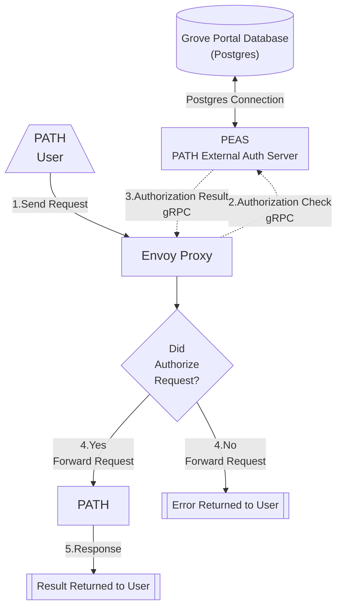

import RemoteMarkdown from '@site/src/components/RemoteMarkdown';

:::warning 🌿 GROVE ONLY

This section is only relevant to Grove's Portal authentication implementation.

If you are not using Grove's Portal authentication, you will likely not find anything of value here.

But feel free to take a look if you're curious.

:::

## Table of Contents <!-- omit in toc -->

- [Overview](#overview)
  - [🫛 `PEAS` - PATH External Auth Server](#-peas---path-external-auth-server)
  - [Architecture Diagram](#architecture-diagram)
  - [Enabling Grove Auth](#enabling-grove-auth)
- [PEAS Documentation](#peas-documentation)
  - [Grove Portal Database](#grove-portal-database)
  - [README.md](#readmemd)
- [Documentation References](#documentation-references)

## Overview

GUARD contains configurations to implement authentication for PATH in a way that is compatible with Grove's Portal.

This Grove-specific implementation utilizes Envoy Gateway's External Authorization feature, which wraps Envoy Proxy's `ext_authz` gRPC interface.

### 🫛 `PEAS` - PATH External Auth Server

[PEAS Repo](https://github.com/buildwithgrove/path-external-auth-server)

PEAS is the Grove-specific implementation of Envoy Gateway's External Authorization feature.

- This is a gRPC server that is responsible for checking if a request is authorized to access a specific service.
- Connects to the Grove Portal database to get the auth data and stores in an in-memory cache.

### Architecture Diagram



### Enabling Grove Auth

To enable Grove Auth, you need to set the following values in the `values.yaml` file:

```yaml
guard.auth.groveLegacy.enabled = true
guard.auth.groveLegacy.peas.enabled = true
```

## PEAS Documentation

### Grove Portal Database

<RemoteMarkdown src="https://raw.githubusercontent.com/buildwithgrove/path-external-auth-server/refs/heads/main/postgres/grove/README.md" />

### README.md

<details>
<summary>PEAS README.md</summary>

<RemoteMarkdown src="https://raw.githubusercontent.com/buildwithgrove/path-external-auth-server/refs/heads/main/README.md" />

</details>

## Documentation References

**Helm Charts**

For the full GUARD Helm Chart documentation, see [GUARD Helm Chart](./3_guard.md).

For the Grove Auth code in the Helm Charts repo, see:

- [Grove Auth `templates` Directory](https://github.com/buildwithgrove/helm-charts/tree/main/charts/guard/templates/auth-grove)
- [GUARD Helm Chart Grove Auth values.yaml](https://github.com/buildwithgrove/helm-charts/blob/main/charts/guard/values.yaml#L50)

**Envoy External Docs**

For an example walkthrough of implementing external authorization with Envoy Gateway, see:

- [Envoy Gateway External Auth Docs](https://gateway.envoyproxy.io/docs/tasks/security/ext-auth/)

For Envoy Proxy's `ext_authz` HTTP Filter documentation (how `PEAS` communicates with Envoy), see:

- [Envoy Proxy External Auth Docs](https://www.envoyproxy.io/docs/envoy/latest/configuration/http/http_filters/ext_authz_filter)