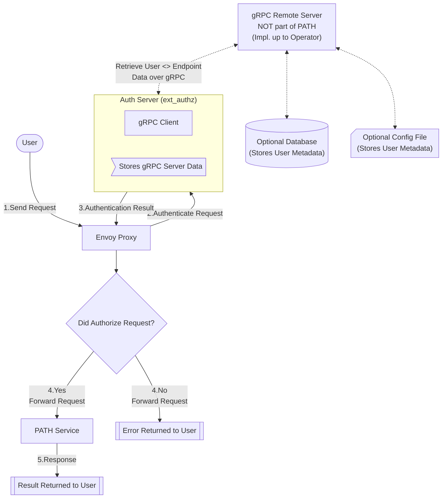

<div align="center">
<h1>PATH<br/>Authorization & Rate Limiting</h1>


</div>
<br/>

# Table of Contents <!-- omit in toc -->

- [1. Overview](#1-overview)
  - [1.1. Components](#11-components)
- [2. Quickstart](#2-quickstart)
- [3. Envoy Proxy](#3-envoy-proxy)
  - [3.1. Contents](#31-contents)
- [4. External Authorization Server](#4-external-authorization-server)
  - [4.1. Remote gRPC Server](#41-remote-grpc-server)
    - [4.1.1. Example Gateway Endpoint Data File](#411-example-gateway-endpoint-data-file)
  - [4.2. Environment Variables](#42-environment-variables)
- [5. Rate Limiter](#5-rate-limiter)
- [6. Architecture](#6-architecture)


## 1. Overview

This folder contains the `Envoy Proxy configuration` and the `Go External Authorization Server` required for managing authorization and rate limiting in the PATH service.

### 1.1. Components

- **Envoy Proxy**: A proxy server that handles incoming requests, performs authentication checks, and routes authorized requests to the PATH service.
- **External Authorization Server**: A Go/gRPC server that evaluates whether incoming requests are authorized to access the PATH service.
- **Rate Limiter**: A service that coordinates rate limiting among all services.
- **Redis**: A database used by the rate limiter to coordinate rate limiting among all services.
- **PATH Service**: The service that handles requests after they have been authorized.
- **Remote gRPC Server** *(optional)*: A server that provides the external authorization server with data on which endpoints are authorized to use the PATH service.

A [docker-compose.yaml](./docker-compose.yaml) file is provided to run all of these services locally.

## 2. Quickstart
1. Create all required config files by running `make init_envoy`.
   - `envoy.yaml` is created with your auth provider's domain and audience.
   - `auth_server/.env` is created with the host and port of the provided remote gRPC server.
   - `gateway-endpoints.yaml` is populated with example data; you can modify this to your needs.
2. Run `make path_up` to start the services with all auth and rate limiting dependencies.

*For instructions on how to run PATH without any auth or rate limiting, see the [PATH README - Quickstart Section](../README.md#quickstart).*

## 3. Envoy Proxy

<div align="center">
  <a href="https://www.envoyproxy.io/docs/envoy/latest/">
    
  <p><b>Envoy Proxy Docs</b></p>
  </a>
</div>

PATH uses Envoy Proxy to handle authorization and rate limiting. 

The `/envoy` directory houses the configuration files and settings for Envoy Proxy. Envoy acts as a gateway, handling incoming requests, performing authentication checks, and routing authorized requests to the PATH service.

### 3.1. Contents

- **envoy.template.yaml**: A template configuration file for Envoy Proxy.
  - To create `envoy.yaml`, run `make copy_envoy_config`.
  - This will prompt you to enter your auth provider's domain and audience and will output the result to `envoy.yaml`.
  - `envoy.yaml` is Git ignored as it contains sensitive information.
- **gateway-endpoints.example.yaml**: An example file containing data on which endpoints are authorized to use the PATH service.
  - To create `gateway-endpoints.yaml`, run `make copy_envoy_gateway_endpoints`.
  - This file is *optional* and used to load data in the `external authorization server` from the `remote gRPC server`.
  - `gateway-endpoints.yaml` is Git ignored as it contains sensitive information.
- **ratelimit.yaml**: Configuration for the rate limiting service.

## 4. External Authorization Server

The `envoy/auth_server` directory contains the Go/gRPC server responsible for authorizing requests forwarded by Envoy Proxy. It evaluates whether incoming requests are authorized to access the PATH service.

This server communicates with a remote gRPC server to populate its in-memory`Gateway Endpoint Data Store`, which provides data on which endpoints are authorized to use the PATH service.

For more information, see:
- [Envoy External Authorization Docs](https://www.envoyproxy.io/docs/envoy/latest/configuration/http/http_filters/ext_authz_filter)

### 4.1. Remote gRPC Server

The implementation of the remote gRPC server is up to the Gateway operator. 

A default Docker image is provided to handle live-loading of data from a `gateway-endpoints.yaml` file for simple use cases or quick startup of PATH.

#### 4.1.1. Example Gateway Endpoint Data File

An example `gateway-endpoints.yaml` file is provided at [envoy/gateway-endpoints.example.yaml](./gateway-endpoints.example.yaml).

```yaml
endpoints:
  endpoint_1:
    endpoint_id: "endpoint_1"
    auth:
      authorized_users:
        "auth0|user_1": {}
    user_account:
      account_id: "account_1"
      plan_type: "PLAN_FREE"
    rate_limiting:
      throughput_limit: 30
      capacity_limit: 100
      capacity_limit_period: "CAPACITY_LIMIT_PERIOD_DAILY"
  endpoint_2:
    endpoint_id: "endpoint_2"
    auth:
      authorized_users:
        "auth0|user_2": {}
    user_account:
      account_id: "account_2"
      plan_type: "PLAN_UNLIMITED"
    rate_limiting:
      throughput_limit: 50
      capacity_limit: 200
      capacity_limit_period: "CAPACITY_LIMIT_PERIOD_MONTHLY"
```

Run `make copy_envoy_gateway_endpoints` to create an example `gateway-endpoints.yaml` file used by the remote gRPC server.

The contents of this file represent the gateway endpoints that are authorized to use the PATH service for a specific gateway operator.

### 4.2. Environment Variables

The external authorization server requires the following environment variables to be set:

- `GRPC_HOST_PORT`: The host and port of the remote gRPC server.
- `GRPC_USE_INSECURE`: Set to `true` if the remote gRPC server does not use TLS (default: `false`).

Run `make copy_envoy_env` to create the `.env` file needed to run the external authorization server locally in Docker.

## 5. Rate Limiter

Rate limiting is configured through the [`/envoy/ratelimit.yaml`](./ratelimit.yaml) file. 

For more advanced configuration options, refer to the Envoy documentation:

- [Envoy Proxy Rate Limit Docs](https://www.envoyproxy.io/docs/envoy/latest/configuration/http/http_filters/rate_limit_filter)

- [Envoy Rate Limit Github](https://github.com/envoyproxy/ratelimit)

## 6. Architecture


