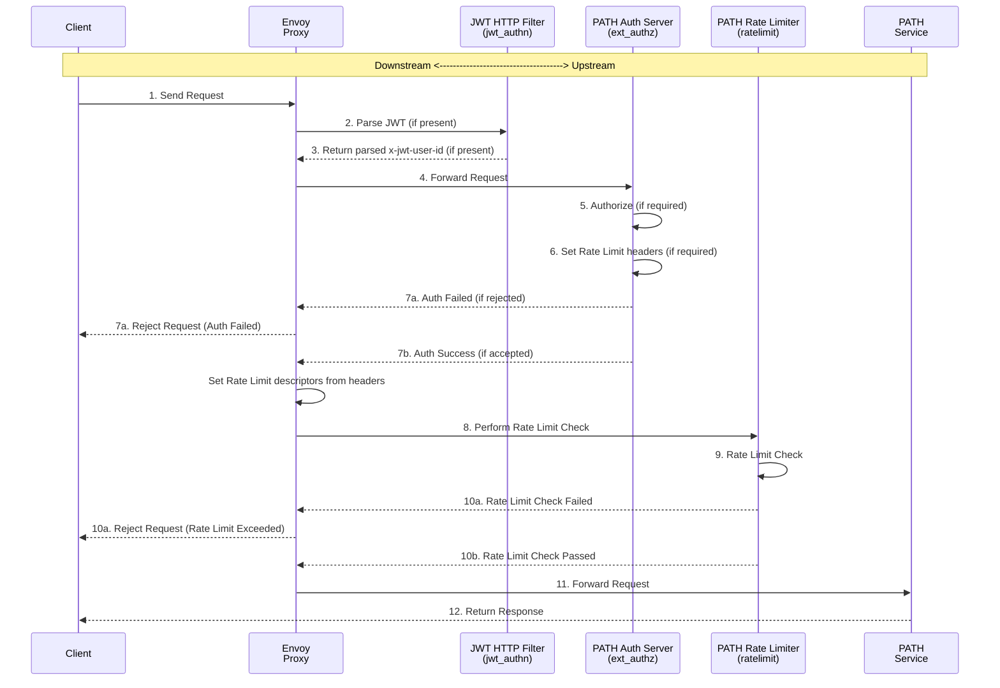
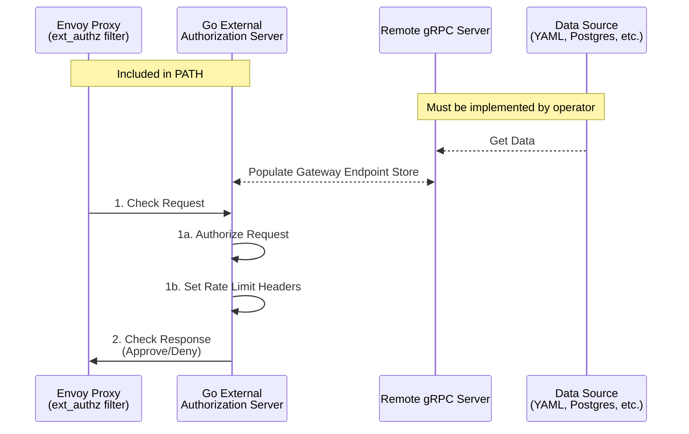

<div align="center">
<h1>PATH<br/>Authorization & Rate Limiting</h1>


</div>
<br/>

# Table of Contents <!-- omit in toc -->
****
- [1. Overview](#1-overview)
  - [1.1. Components](#11-components)
  - [1.2 URL Format](#12-url-format)
- [2. Quickstart](#2-quickstart)
- [3. Envoy Proxy](#3-envoy-proxy)
  - [3.1. Contents](#31-contents)
  - [3.2. Envoy HTTP Filters](#32-envoy-http-filters)
  - [3.3. Request Lifecycle](#33-request-lifecycle)
- [4. Gateway Endpoint Authorization](#4-gateway-endpoint-authorization)
  - [4.1 JSON Web Token (JWT) Authorization](#41-json-web-token-jwt-authorization)
  - [4.2 API Key Authorization](#42-api-key-authorization)
  - [4.3 No Authorization](#43-no-authorization)
- [5. External Authorization Server](#5-external-authorization-server)
  - [5.1. Gateway Endpoints gRPC Service](#51-gateway-endpoints-grpc-service)
  - [5.2. Remote gRPC Auth Server](#52-remote-grpc-auth-server)
    - [5.2.1. PATH Auth Data Server](#521-path-auth-data-server)
    - [5.2.2. Example Gateway Endpoint YAML File](#522-example-gateway-endpoint-yaml-file)
    - [5.2.3. Custom Remote gRPC Server Implementation](#523-custom-remote-grpc-server-implementation)
- [6. Rate Limiter](#6-rate-limiter)
  - [6.1. Rate Limit Configuration](#61-rate-limit-configuration)
  - [6.2. Documentation and Examples](#62-documentation-and-examples)
- [7. Architecture](#7-architecture)


## 1. Overview

This folder contains the `Envoy Proxy configuration` and the `Go External Authorization Server` required for managing authorization and rate limiting in the PATH service.

### 1.1. Components

- **Envoy Proxy**: A proxy server that handles incoming requests, performs auth checks, and routes authorized requests to the PATH service.
- **External Authorization Server**: A Go/gRPC server that evaluates whether incoming requests are authorized to access the PATH service.
- **Rate Limiter**: A service that coordinates rate limiting among all services.
- **Redis**: A database used by the rate limiter to coordinate rate limiting among all services.
- **PATH Service**: The service that handles requests after they have been authorized.
- **Remote gRPC Server** *(Implemented by Gateway Operator)*: A server that provides the external authorization server with data on which endpoints are authorized to use the PATH service.
  - _A basic implementation of the remote gRPC server that loads data from a YAML file is available as a Docker image._

A [docker-compose.yaml](./docker-compose.yaml) file is provided to run all of these services locally.

_[See the Architecture Diagram for more information on how these components interact.](#7-architecture)_

### 1.2 URL Format

When auth is enabled, the required URL format for the PATH service is:

```
https://<SERVICE_NAME>.<PATH_DOMAIN>/v1/<GATEWAY_ENDPOINT_ID>
```
eg.
```
https://eth-mainnet.rpc.grove.city/v1/a1b2c3d4
```
_In this example the `GATEWAY_ENDPOINT_ID` is `a1b2c3d4`._

Requests that are either missing the `<GATEWAY_ENDPOINT_ID>` or which contain an ID that is not present in the `Go External Authorization Server`'s `Gateway Endpoint Store` will be rejected.

## 2. Quickstart
1. Create all required config files by running `make init_envoy`.
   - `envoy.yaml` is created with your auth provider's domain and audience.
   - `auth_server/.env` is created with the host and port of the provided remote gRPC server.
   - `gateway-endpoints.yaml` is populated with example data; you can modify this to your needs.
2. Run `make path_up` to start the services with all auth and rate limiting dependencies.

*For instructions on how to run PATH without any auth or rate limiting, see the [PATH README - Quickstart Section](../README.md#quickstart).*

## 3. Envoy Proxy

<div align="center">
  <a href="https://www.envoyproxy.io/docs/envoy/latest/">
    
  <p><b>Envoy Proxy Docs</b></p>
  </a>
</div>

PATH uses Envoy Proxy to handle authorization and rate limiting. 

The `/envoy` directory houses the configuration files and settings for Envoy Proxy. Envoy acts as a gateway, handling incoming requests, performing auth checks, and routing authorized requests to the PATH service.

### 3.1. Contents

- **envoy.template.yaml**: A template configuration file for Envoy Proxy.
  - To create `envoy.yaml`, run `make copy_envoy_config`.
  - This will prompt you to enter your auth provider's domain and audience and will output the result to `envoy.yaml`.
  - `envoy.yaml` is Git ignored as it contains sensitive information.
- **gateway-endpoints.example.yaml**: An example file containing data on which endpoints are authorized to use the PATH service.
  - To create `gateway-endpoints.yaml`, run `make copy_envoy_gateway_endpoints`.
  - This file is only required if loading `GatewayEndpoint` data from a YAML file and used to load data in the `external authorization server` from the `remote gRPC server`.
  - `gateway-endpoints.yaml` is Git ignored as it may contain sensitive information.
- **ratelimit.yaml**: Configuration for the rate limiting service.

### 3.2. Envoy HTTP Filters

The PATH Auth Server uses the following [Envoy HTTP filters](https://www.envoyproxy.io/docs/envoy/latest/configuration/http/http_filters/http_filters) to handle authorization:

- **[header_mutation](https://www.envoyproxy.io/docs/envoy/latest/configuration/http/http_filters/header_mutation_filter)**: Ensures the request does not have the `x-jwt-user-id` header set before it is forwarded upstream.
- **[jwt_authn](https://www.envoyproxy.io/docs/envoy/latest/configuration/http/http_filters/jwt_authn_filter)**: Performs JWT verification and sets the `x-jwt-user-id` header.
- **[ext_authz](https://www.envoyproxy.io/docs/envoy/latest/configuration/http/http_filters/ext_authz_filter)**: Performs authorization checks using the PATH Auth Server external authorization server.
- **[ratelimit](https://www.envoyproxy.io/docs/envoy/latest/configuration/http/http_filters/rate_limit_filter)**: Performs rate limiting checks using the Rate Limiter service.

### 3.3. Request Lifecycle


## 4. Gateway Endpoint Authorization

The `Go External Authorization Server` evaluates whether incoming requests are authorized to access the PATH service based on the `AuthType` field of the `GatewayEndpoint` proto struct. 

Three authorization types are supported:
- [JSON Web Token (JWT) Authorization](#41-json-web-token-jwt-authorization)
- [API Key Authorization](#42-api-key-authorization)
- [No Authorization](#43-no-authorization)

### 4.1 JSON Web Token (JWT) Authorization

For GatewayEndpoints with the `AuthType` field set to `JWT_AUTH`, a valid JWT issued by the auth provider specified in the `envoy.yaml` file is required to access the PATH service.

_Example Request Header:_
```bash
-H "Authorization: Bearer <JWT>"
```

The `jwt_authn` filter will verify the JWT and, if valid, set the `x-jwt-user-id` header from the `sub` claim of the JWT. An invalid JWT will result in an error. 

The `Go External Authorization Server` will use the `x-jwt-user-id` header to make an authorization decision; if the `GatewayEndpoint`'s `Auth.AuthorizedUsers` field contains the `x-jwt-user-id` value, the request will be authorized.

_Example auth provider user ID header:_
```
x-jwt-user-id: auth0|a12b3c4d5e6f7g8h9
```

For more information, see:
- [Envoy JWT Authn Docs](https://www.envoyproxy.io/docs/envoy/latest/configuration/http/http_filters/jwt_authn_filter)

### 4.2 API Key Authorization

For GatewayEndpoints with the `AuthType` field set to `API_KEY_AUTH`, a static API key is required to access the PATH service.

_Example Request Header (both Bearer and non-Bearer are supported):_
```bash
-H "Authorization: <API_KEY>"
-H "Authorization: Bearer <API_KEY>"
```

The `Go External Authorization Server` will use the `authorization` header to make an authorization decision; if the `GatewayEndpoint`'s `Auth.ApiKey` field matches the `API_KEY` value, the request will be authorized.

### 4.3 No Authorization

For GatewayEndpoints with the `AuthType` field set to `NO_AUTH`, no authorization is required to access the PATH service. 

All requests for GatewayEndpoints with the `AuthType` field set to `NO_AUTH` will be authorized by the `Go External Authorization Server`.

## 5. External Authorization Server

The `envoy/auth_server` directory contains the `Go External Authorization Server` called by the Envoy `ext_authz` filter. It evaluates whether incoming requests are authorized to access the PATH service.

This server communicates with a `Remote gRPC Server` to populate its in-memory `Gateway Endpoint Store`, which provides data on which endpoints are authorized to use the PATH service.



The external authorization server requires the following environment variables to be set:

- `GRPC_HOST_PORT`: The host and port of the remote gRPC server.
- `GRPC_USE_INSECURE`: Set to `true` if the remote gRPC server does not use TLS (default: `false`).

Run `make copy_envoy_env` to create the `.env` file needed to run the external authorization server locally in Docker.

For more information, see:
- [Envoy External Authorization Docs](https://www.envoyproxy.io/docs/envoy/latest/configuration/http/http_filters/ext_authz_filter)
- [Envoy Go Control Plane Auth Package](https://pkg.go.dev/github.com/envoyproxy/go-control-plane@v0.13.0/envoy/service/auth/v3)

### 5.1. Gateway Endpoints gRPC Service

Both the `Go External Authorization Server` and the `Remote gRPC Server` use the gRPC service and types defined in the [`gateway_endpoint.proto`](./auth_server/proto/gateway_endpoint.proto) file.

This service defines two main methods for populating the `Go External Authorization Server`'s `Gateway Endpoint Store`:
```proto
service GatewayEndpoints {
  // GetInitialData requests the initial set of GatewayEndpoints from the remote gRPC server.
  rpc GetInitialData(InitialDataRequest) returns (InitialDataResponse);

  // StreamUpdates listens for updates from the remote gRPC server and streams them to the client.
  rpc StreamUpdates(UpdatesRequest) returns (stream Update);
}
```

### 5.2. Remote gRPC Auth Server

The `Remote gRPC Server` is responsible for providing the `Go External Authorization Server` with data on which endpoints are authorized to use the PATH service.

**The implementation of the remote gRPC server is up to the Gateway operator.**

#### 5.2.1. PATH Auth Data Server

The `PATH Auth Data Server (PADS)` is an implementation of the `Remote gRPC Server` that provides `Gateway Endpoint` data to the `Go External Authorization Server` in order to enable authorization for the PATH Gateway.

It is provided to allow an easy default implementation of the remote gRPC server by Gateway operators, or as a starting point for custom implementations. 

The Docker image for `PADS` is available at:
```bash
ghcr.io/buildwithgrove/path-auth-data-server:latest
```

_This Docker image is loaded by default in the [docker-compose.yml](../docker-compose.yml#L90) file at the root of the PATH repo._

_`PADS` loads data from the `gateway-endpoints.yaml` file specified by the `YAML_FILEPATH` environment variable._

#### 5.2.2. Example Gateway Endpoint YAML File

An example `gateway-endpoints.yaml` file is provided at [envoy/gateway-endpoints.example.yaml](./gateway-endpoints.example.yaml).

```yaml
endpoints:
  endpoint_1:
    endpoint_id: "endpoint_1"
    auth:
      require_auth: true
      authorized_users:
        "auth0|user_1": {}
    user_account:
      account_id: "account_1"
      plan_type: "PLAN_UNLIMITED"

  endpoint_2:
    endpoint_id: "endpoint_2"
    auth:
      require_auth: false
    user_account:
      account_id: "account_2"
      plan_type: "PLAN_FREE"
    rate_limiting:
      throughput_limit: 30
      capacity_limit: 100000
      capacity_limit_period: "CAPACITY_LIMIT_PERIOD_MONTHLY"
```

_In this example, `endpoint_1` is authorized for `user_1` and `endpoint_2` is authorized for all users._

Run `make copy_envoy_gateway_endpoints` to create an example `gateway-endpoints.yaml` file used by the remote gRPC server.

The contents of this file represent the gateway endpoints that are authorized to use the PATH service for a specific gateway operator.

#### 5.2.3. Custom Remote gRPC Server Implementation

If wishing to implement a custom remote gRPC server, the implementation should import the Go `github.com/buildwithgrove/path/envoy/auth_server/proto` package, which is autogenerated from the [`gateway_endpoint.proto`](./auth_server/proto/gateway_endpoint.proto) file.

[The custom implementation must use the methods defined in the `GatewayEndpoints` service:](#51-gateway-endpoints-grpc-service)
- `GetInitialData`
- `StreamUpdates`

Example simple Go implementation:

_server.go_
```go
// Implementation of DataSource interface up to the Gateway operator.
// eg. It could load data from a Postgres database or YAML file.
type DataSource interface {
	GetInitialData() (*proto.InitialDataResponse, error)
	SubscribeUpdates() (<-chan *proto.Update, error)
}

// Server implements the gRPC server for GatewayEndpoints.
// It uses a DataSource to retrieve initial data and updates.
type Server struct {
	proto.UnimplementedGatewayEndpointsServer
	GatewayEndpoints map[string]*proto.GatewayEndpoint
	updateCh         chan *proto.Update
	mu               sync.RWMutex
	dataSource       DataSource
}

// NewServer creates a new Server instance using the provided DataSource.
func NewServer(dataSource DataSource) (*Server, error) {
	server := &Server{
		GatewayEndpoints: make(map[string]*proto.GatewayEndpoint),
		updateCh:         make(chan *proto.Update, 100),
		dataSource:       dataSource,
	}

	initialData, err := dataSource.GetInitialData()
	if err != nil {
		return nil, err
	}

	server.mu.Lock()
	server.GatewayEndpoints = initialData.Endpoints
	server.mu.Unlock()

	updatesCh, err := dataSource.SubscribeUpdates()
	if err != nil {
		return nil, err
	}

	go server.handleDataSourceUpdates(updatesCh)

	return server, nil
}

// GetInitialData handles the gRPC request to retrieve initial GatewayEndpoints data.
func (s *Server) GetInitialData(ctx context.Context, req *proto.InitialDataRequest) (*proto.InitialDataResponse, error) {
	s.mu.RLock()
	defer s.mu.RUnlock()
	return &proto.InitialDataResponse{Endpoints: s.GatewayEndpoints}, nil
}

// StreamUpdates streams updates to the client whenever the data source changes.
func (s *Server) StreamUpdates(req *proto.UpdatesRequest, stream proto.GatewayEndpoints_StreamUpdatesServer) error {
	for update := range s.updateCh {
		if err := stream.Send(update); err != nil {
			return err
		}
	}
	return nil
}

// handleDataSourceUpdates listens for updates from the DataSource and updates the server state accordingly.
func (s *Server) handleDataSourceUpdates(updatesCh <-chan *proto.Update) {
	for update := range updatesCh {
		s.mu.Lock()
		if update.Delete {
			delete(s.GatewayEndpoints, update.EndpointId)
		} else {
			s.GatewayEndpoints[update.EndpointId] = update.GatewayEndpoint
		}
		s.mu.Unlock()

		// Send the update to any clients streaming updates.
		s.updateCh <- update
	}
}
```

_main.go_
```go
func main() {

	// Implementation of DataSource interface up to the Gateway operator.
	dataSource, err := NewDataSource()
	if err != nil {
		panic(fmt.Sprintf("failed to create YAML data source: %v", err))
	}

	lis, err := net.Listen("tcp", ":50051")
	if err != nil {
		panic(fmt.Sprintf("failed to listen: %v", err))
	}

	server, err := server.NewServer(dataSource)
	if err != nil {
		panic(fmt.Sprintf("failed to create server: %v", err))
	}

	grpcServer := grpc.NewServer()
	proto.RegisterGatewayEndpointsServer(grpcServer, server)
	httpServer := &http.Server{Handler: grpcServer}

	if err := httpServer.Serve(lis); err != nil {
		panic(fmt.Sprintf("failed to serve: %v", err))
	}
}

```


## 6. Rate Limiter

Rate limiting is configured through the [`/envoy/ratelimit.yaml`](./ratelimit.yaml) file. 

The default throughput limit is 30 requests per second for GatewayEndpoints with the `PLAN_FREE` plan type.

### 6.1. Rate Limit Configuration

1. The `Go External Authorization Server` sets the `x-rl-endpoint-id` and `x-rl-plan` headers if the `GatewayEndpoint` for the request should be rate limited.

2. Envoy Proxy is configured to forward the `x-rl-endpoint-id` and `x-rl-plan` headers to the rate limiter service as descriptors.
    ```yaml
    rate_limits:
      - actions:
          - request_headers:
              header_name: "x-rl-endpoint-id"
              descriptor_key: "x-rl-endpoint-id"
          - request_headers:
              header_name: "x-rl-plan"
              descriptor_key: "x-rl-plan"
    ```
    _envoy.yaml_

3. The rate limiter service is configured to limit the rate for `PLAN_FREE` GatewayEndpoints to 30 requests per second based on the `x-rl-endpoint-id` and `x-rl-plan` descriptors.

    ```yaml
    domain: rl
    descriptors:  
      - key: x-rl-endpoint-id    
        descriptors:      
          - key: x-rl-plan
            value: "PLAN_FREE"
            rate_limit:
              unit: second
              requests_per_unit: 30      
    ```
    _ratelimit.yaml_

### 6.2. Documentation and Examples

As Envoy's rate limiting configuration is fairly complex, this blog article provides a good overview of the configuration options:
- [Understanding Envoy Rate Limits](https://www.aboutwayfair.com/tech-innovation/understanding-envoy-rate-limits)

For more advanced configuration options, refer to the Envoy documentation:

- [Envoy Proxy Rate Limit Docs](https://www.envoyproxy.io/docs/envoy/latest/configuration/http/http_filters/rate_limit_filter)

- [Envoy Rate Limit Github](https://github.com/envoyproxy/ratelimit)

## 7. Architecture


